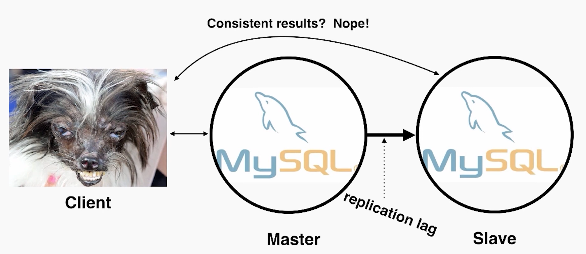
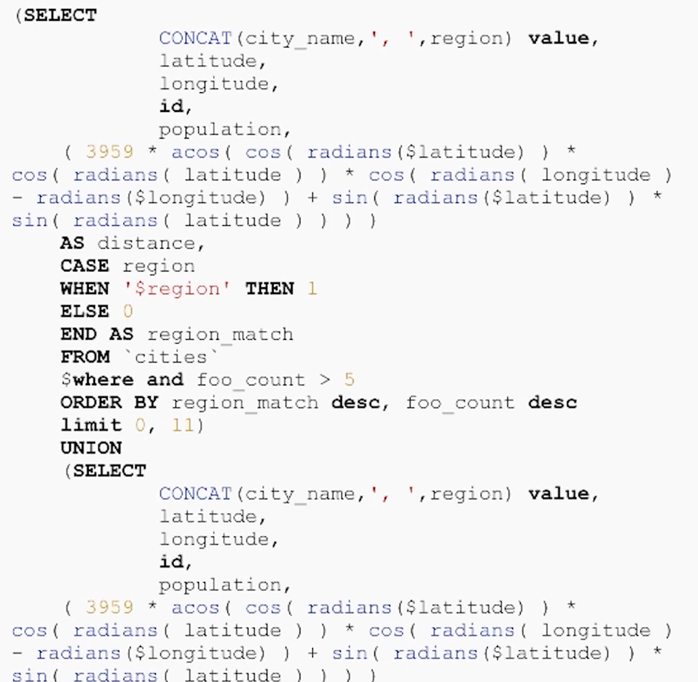
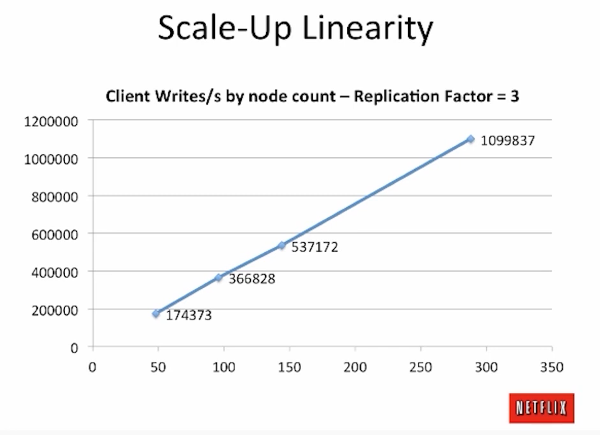
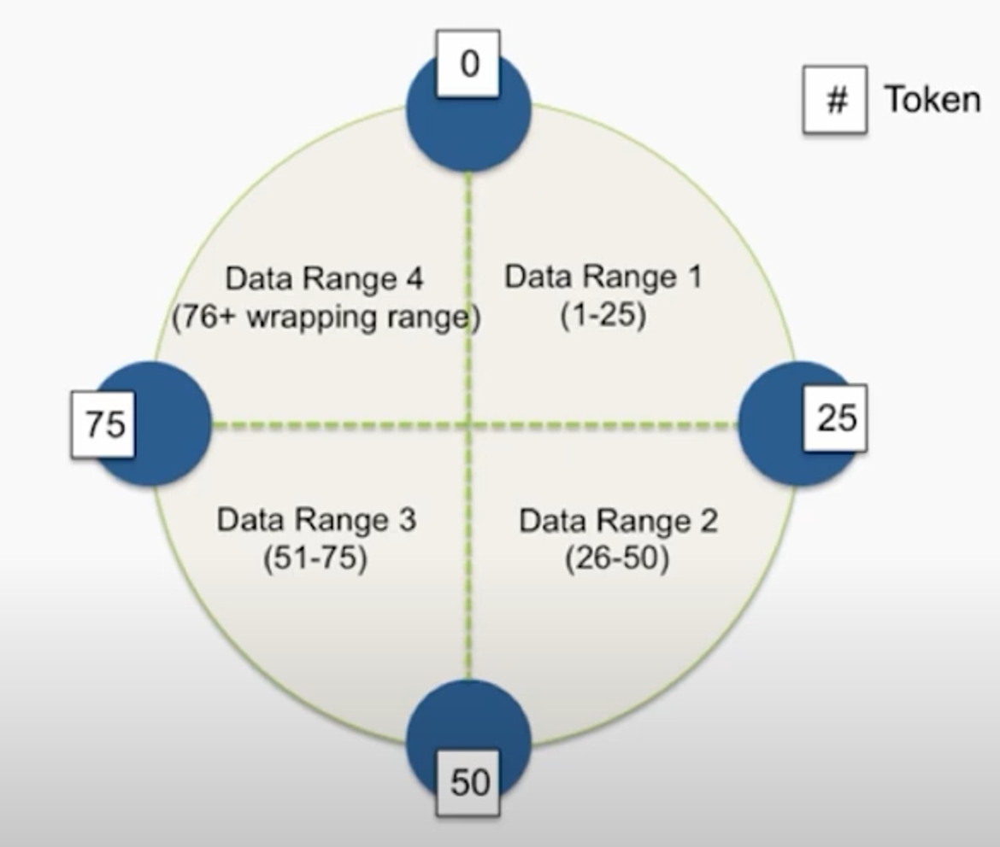
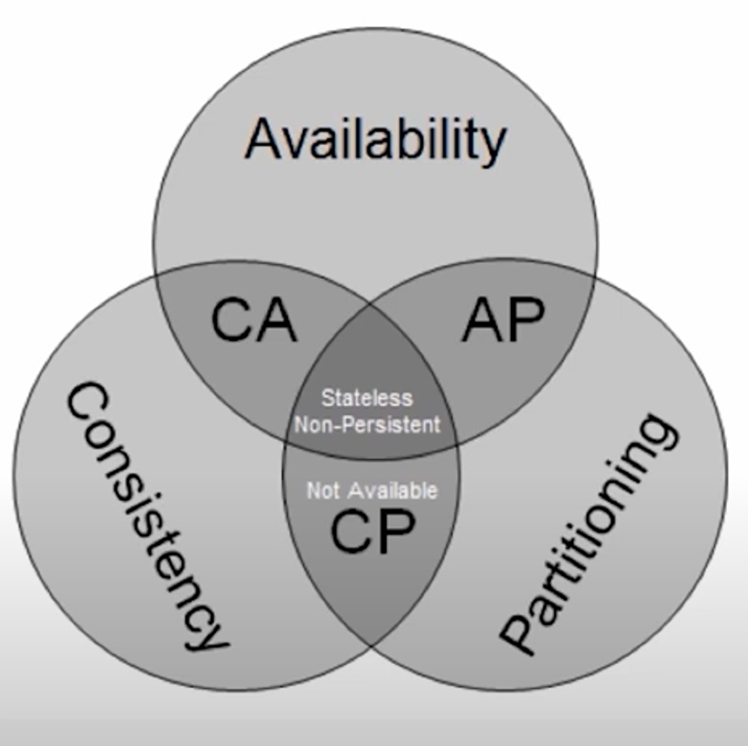
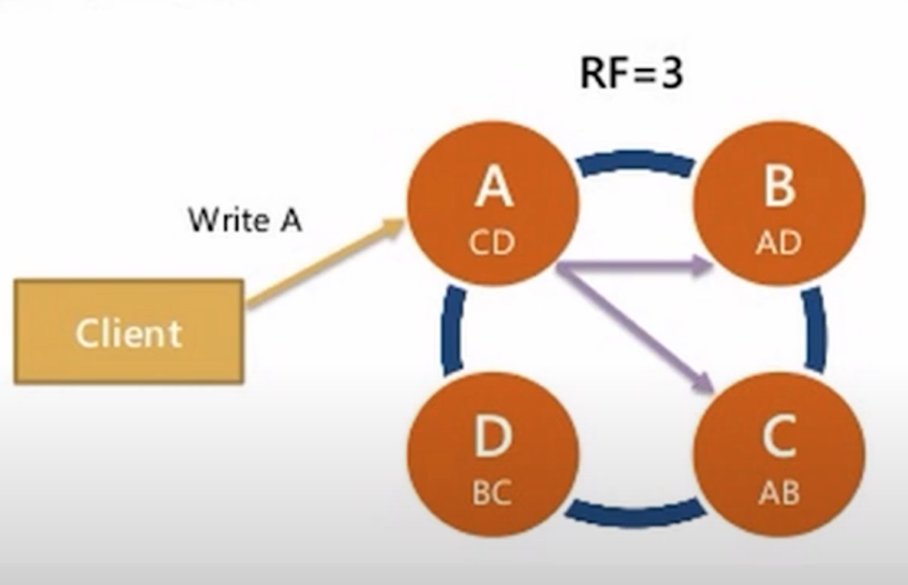
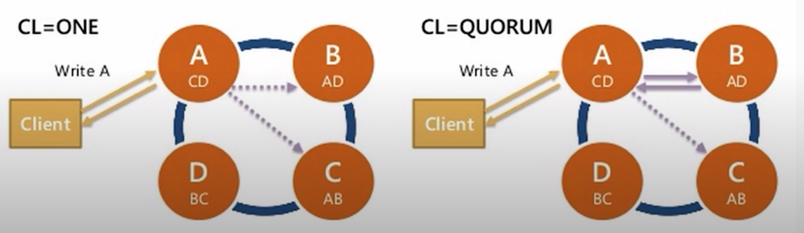
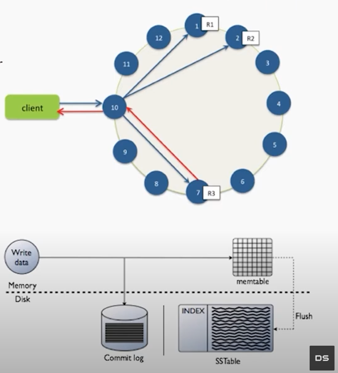
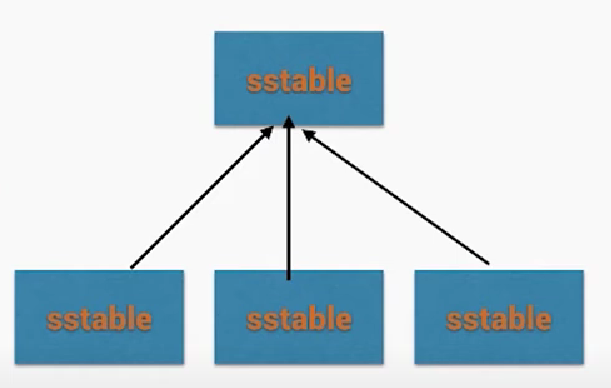
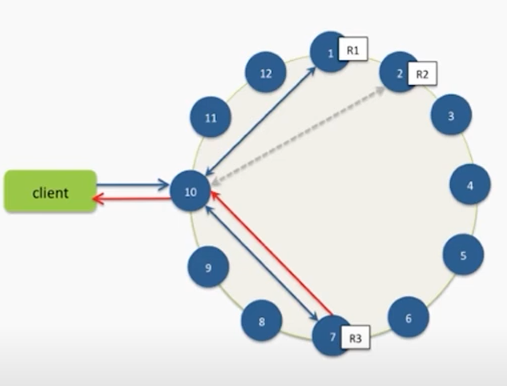

- [DS101: Introduction to Apache Cassandra](#ds101-introduction-to-apache-cassandra)
  - [Relational Databases](#relational-databases)
    - [Medium Data](#medium-data)
    - [Can RDBMS work for big data?](#can-rdbms-work-for-big-data)
    - [Third Normal Form Doesn't Scale](#third-normal-form-doesnt-scale)
    - [Sharding is a nightmare](#sharding-is-a-nightmare)
    - [High Availability.. not really](#high-availability-not-really)
    - [Summary of failure](#summary-of-failure)
    - [Lessons Learned](#lessons-learned)
  - [Cassandra Overview](#cassandra-overview)
    - [What is Apache Cassandra?](#what-is-apache-cassandra)
    - [Hash Ring](#hash-ring)
    - [Partition key](#partition-key)
    - [CAP Tradeoffs](#cap-tradeoffs)
    - [Replication](#replication)
    - [Consistency Levels](#consistency-levels)
    - [Multi Datacenter](#multi-datacenter)
  - [Cassandra Internals and Choosing a Distribution](#cassandra-internals-and-choosing-a-distribution)
    - [The Write Path](#the-write-path)
      - [What is an SSTable?](#what-is-an-sstable)
    - [The Read Path](#the-read-path)
    - [Picking a distribution](#picking-a-distribution)
      - [Open Source](#open-source)
      - [DataStax Enterprise](#datastax-enterprise)

## DS101: Introduction to Apache Cassandra

### Relational Databases

#### Medium Data

- fits on 1 machine
- RDBMS is fine
  - postgres
  - mysql
- Supports hundreds of concurrent users
- ACID makes us feel good (Atomicity, Consistency, Isolation and Durability)

#### Can RDBMS work for big data?

Replication: ACID is a lie!

Data is replicated asynchronously, known as replication lag

#### Third Normal Form Doesn't Scale

- Queries are unpredictable
- Users are impatient
- Data must be denormalized
- If data > memory, you = history
- Disk seeks are the worst

#### Sharding is a nightmare

> instead of having all the data in one database, in one master, you split it up in multiple databases.

- Data is all over the place
- No more joints
- No more aggregations
- Denormalize all the things
- Querying secondary indexes requires hitting every shard
- Adding shards requires manually moving data
- Schema changes

#### High Availability.. not really

- Master failover.. who's responsible?
  - Another moving part
  - Bolted on hack
- Multi-DC is a mess
- Downtime is frequent
  - Change database settings (innodb buffer pool etc.)
  - Drive, power supply failures
  - OS updates

#### Summary of failure

- Scaling is a pain
- ACID is naive at best
  - You aren't consistent
- Re-sharding is a manual process
- We're going to denormalize for performance
- High availability is complicated, requires additional operational overhead

#### Lessons Learned

- Consistency is not practical
  - So we give it up
- Manual sharding & rebalancing is hard
  - So let's build in
- Every moving part makes systems more complex
  - So let's simplify our architecture - no more master/slave
- Scaling is expensive
  - We want commodity software
- Scatter/gather no good
  - We denormalize for real time query performance
  - Goal is to always hit 1 machine

### Cassandra Overview

#### What is Apache Cassandra?

- Fast distributed database
- High availability
- Linear scalability
- Predictable performance
- No SPOF
- Multi-Datacenter
- Commodity hardware
- Easy to manage operationally
- Not a drop in replacement for RDBMS

#### Hash Ring

- No master / slave / replica sets
- No config servers, zookeper
- Data is partitioned around the ring
- Data is replicated to RF=N servers
- All nodes hold data and can answer queries (both reads & writes)
- Location of data on ring is determined by partition key

#### Partition key

Part of a primary key, used for locating the range od hashes (bucket) inside the hash ring to address the correct node.

#### CAP Tradeoffs

- Impossible to be both consistent and highly available during a network partition
- Latency between data centers also makes consistency impractical
- Cassandra chooses **Availability & Partition Tolerance** over Consistency (AP)

#### Replication

- Data is replicated automatically
- You pick number of servers
- Called **replication factor or RF**
- Data is ALWAYS replicated to each replica
- If a machine is down, missing data is replayed via **hinted handoff** (remaining nodes save mutations locally as hints and when the node comes back up, the hints are replayed to the node to sync the data)

#### Consistency Levels

- Per query consistency
- ALL, QUORUM, ONE
- How many replicas for query to respond OK

**Direct impact:**
- sped of reads & writes
- affects availability (high consistency level -> more dependency on the nodes going down)

#### Multi Datacenter

- Typical Usage: clients write to local DC, replicates async to other DCs
- Replication factor per keyspace per datacenter
- Datacenters can be physical or logical

### Cassandra Internals and Choosing a Distribution

#### The Write Path

- Writes are written to any node in the cluster (coordinator)
- Writes are written to **commit log**, then to **memtable**
- Every write includes a timestamp
- Memtable flushed to disk periodically (**sstable**)
- New memtable is created in memory
- Deletes are a special write case, called a **tombstone** (a marker that says there is no data here anymore)

Cassandra is VERY fast in writing data because of the simplicity of the write path.

##### What is an SSTable?

- Immutable data file for row storage
- Every write includes a timestamp of when it was written
- Partition is spread across multiple SSTables
- Same column can be in multiple SSTables
- Merged through compaction, only latest timestamp is kept
- Deletes are written as tombstones
- Easy backups

#### The Read Path

- Any server may be queried, it acts as the coordinator
- Contacts nodes with the requested key
- On each node, data is pulled from SSTables and merged if there is some unflushed data
- Consistency < ALL performs **read repair** in the background (**read_repair_chance**)

#### Picking a distribution

##### Open Source

- Latest, bleeding edge features
- File JIRAs
- Support via mailing list & IRC
- Fix bugs
- cassandra.apache.org
- Perfect for hacking

##### DataStax Enterprise

- Integrated Multi-DC Search
- Integrated Spark for Analytics
- Free Startup Program
  - < 3MM rev & < $30M funding
- Extended Support
- Additional QA
- Focused on stable releases for enterprises
- Included on USB

