- [DS201: Foundations of Apache Cassandra](#ds201-foundations-of-apache-cassandra)
  - [Quick Wins](#quick-wins)
    - [CQL Fundamentals](#cql-fundamentals)
      - [UUID and TIMEUUID](#uuid-and-timeuuid)
      - [INSERT](#insert)
      - [SELECT](#select)
    - [COPY](#copy)
  - [Partitions](#partitions)
  - [Clustering Columns](#clustering-columns)
    - [Querying Clustering Columns](#querying-clustering-columns)
    - [Changing Default Ordering](#changing-default-ordering)
    - [Allow Filtering](#allow-filtering)
  - [Application Connectivity](#application-connectivity)
    - [Drivers](#drivers)
  - [Nodes](#nodes)
    - [What does the node do?](#what-does-the-node-do)
    - [What can the node handle?](#what-can-the-node-handle)
    - [Nodetool](#nodetool)
  - [Ring](#ring)
    - [Partitioner](#partitioner)
    - [Node joining the cluster](#node-joining-the-cluster)
    - [Drivers](#drivers-1)
    - [Horizontal vs. Vertical Scaling](#horizontal-vs-vertical-scaling)
  - [Peer to Peer](#peer-to-peer)
  - [Vnodes](#vnodes)
    - [VNode Details](#vnode-details)
    - [Configuration](#configuration)
  - [Gossip](#gossip)
    - [Choosing a Gossip Node](#choosing-a-gossip-node)
  - [Snitch](#snitch)
    - [Simple Snitch](#simple-snitch)
    - [Property File Snitch](#property-file-snitch)
    - [Gossiping Property File Snitch](#gossiping-property-file-snitch)
    - [Rack Inferring Snitch](#rack-inferring-snitch)
    - [Cloud-Based Snitches](#cloud-based-snitches)
    - [Dynamic Snitch](#dynamic-snitch)
    - [Configuring Snitches](#configuring-snitches)
  - [Replication](#replication)
    - [Multi-Datacenter Replication](#multi-datacenter-replication)
  - [Consistency](#consistency)
    - [One Datacenter](#one-datacenter)
    - [Multiple Datacenters](#multiple-datacenters)

### DS201: Foundations of Apache Cassandra

#### Quick Wins

##### CQL Fundamentals

- CQL
  - Cassandra Query Language
  - Similar to SQL
- Keyspaces
  - Top-level namespace/container
  - Similar to a relational database schema
  - Replication paramteres required
  - USE command switches between keyspaces
- Tables
  - Keyspaces contain tables
  - Tables contain data
- Core datatypes
  - text
    - UTF* encoded string
    - varchar is same as text
  - int
    - signed
    - 32 bits
  - timestamp
    - date and time
    - 64 bit integer
    - Stores number of seconds since Jan. 1, 1970 00.00.00 GMT

###### UUID and TIMEUUID

> Used in place of integer IDs because Cassandra is a distributed database

- Universally Unique Identifier:
  - Ex.: 550e8400-e29b-41d4-a716-446655440000
  - generate via uuid()
- TIMEUUID embeds a TIMESTAMP value
  - Ex.: 550e8400-e29b-41d4-a716-446655440000
  - sortable
  - Generate via row()

###### INSERT

> similar to relational syntax

```sql
INSERT into users (user_id, first_name, last_name) VALUES (uuid(), 'Joseph', 'Chu');
```

###### SELECT

> similar to relational syntax

```sql
SELECT * from users;
SELECT first_name, last_name FROM users;
SELECT * from users WHERE user_id = 550e8400-e29b-41d4-a716-446655440000;
```

##### COPY

- Imports/exports CSV (comma-separated values)

```sql
COPY table1 (column1, column2, column3) FROM 'table1data.csv';
```

- Header parameter skips the first line in the file

```sql
COPY table1 (column1, column2, column3) FROM 'table1data.csv' WITH HEADER=true;
```

- There are several ways to get data into Cassandra:
  - COPY
  - Apache Spark
  - Drivers
  - Etc.
- COPY is prettu primitive
- but COPY is a really good starting point

#### Partitions

> The partition key is how the data is placed on the ring.
> The partition key is turned to a hash number with the help of the consistent hashing function
> The first value in the primary key is ALWAYS a partition key


**Advantage: I always know exactly where my data will go on the ring**

#### Clustering Columns

> The second part of the primary key

- A partition key is not enough for uniqueness of data
- The primary key controls uniqueness
- YOU CAN'T CHANGE THE PRIMARY KEY OF THE EXISTING DATA MODEL
- Choose clustering columns to create **uniqueness** to avoid collisions and overwriting of data

##### Querying Clustering Columns

- You must provide a partition key
- Clustering columns can follow thereafter
- The order of the comparisons in the query should follow the order of clustering columns in the primary key
- You can perform either equality (=) or range queries (<, >) on clustering columns
- All equality comparisons must come before inequality comparisons
- Since data is sorted on disk, range searches are a binary search followed by a linear read

##### Changing Default Ordering

- Clustering columns default ascending order
- Change ordering direction via WITH CLUSTERING ORDER BY
- Must include all columns including and up to the columns you wish to order descending
- For example, we esclude id below and assume ASC

  ```sql
  CREATE TABLE users (
    state text,
    city text,
    name text,
    id uuid,
    PRIMARY KEY ((state), city, name, id))
    WITH CLUSTERING ORDER BY (city DESC, name ASC);
  ```

##### Allow Filtering

- ALLOW FILTERING relaxes the querying on partition key constraint
- You can then query on just clustering columns
- Causes Apache Cassandra to scan all partitions in the table
- Don't use it
  - Unless you really have to
  - Best on small data sets


#### Application Connectivity

##### Drivers

- Drivers easily connect your application to your Apache Cassandra database
- Driver languages:
  - Java
  - Python
  - C#
  - C++
  - others

#### Nodes

A single node runs on a server or in a Virtual Machine (VM) and it runs in a Java Virtual Machine (JVM), which is a Java process. The java process is running Apache Cassandra, and Apache Cassandra is written in Java.

The node itself can live in:
- a cloud
- inside of an on premise datacenter
- on a variety of disks

Local storage is recommended!
Running on a sand is NOT recommended!

##### What does the node do?

> responsible for the data stored in the node
> all the data stored there is in a distributed hashtable

##### What can the node handle?

- 6.000 - 12.000 transactions/second/core (reads and writes)
- 2-4 Terabytes on SSD or rotational disk

##### Nodetool

- Node management
- Located in the bin/ folder
- Operates on the whole cluster

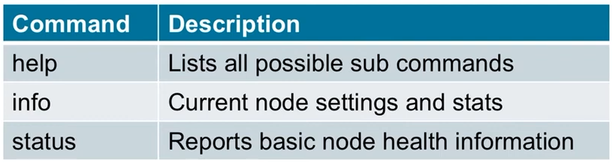

#### Ring

Ring = Cluster

Why not run a single node? Pressure of scaling.

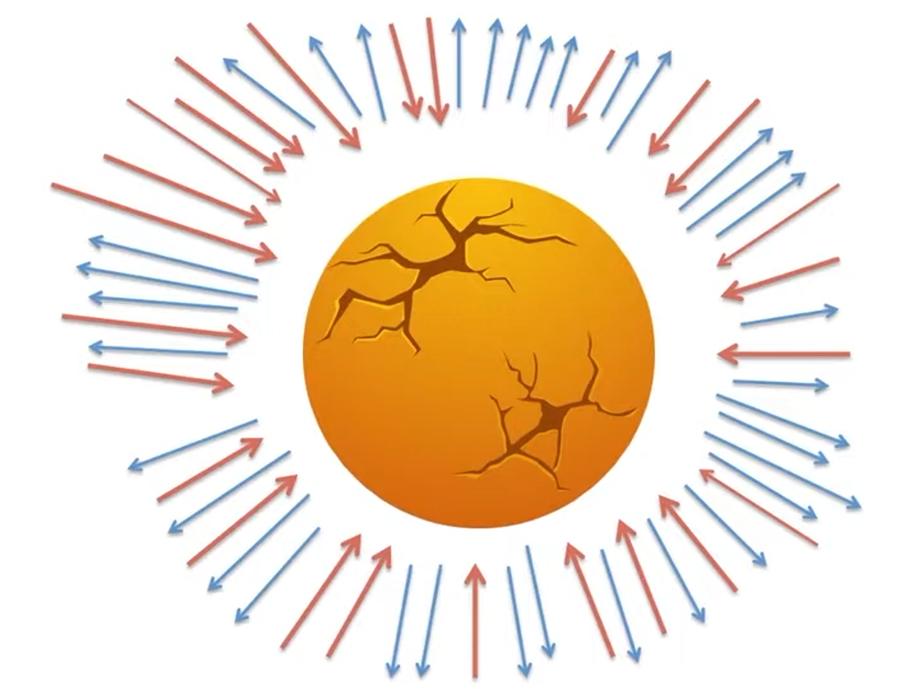

When this happens, we just add more nodes

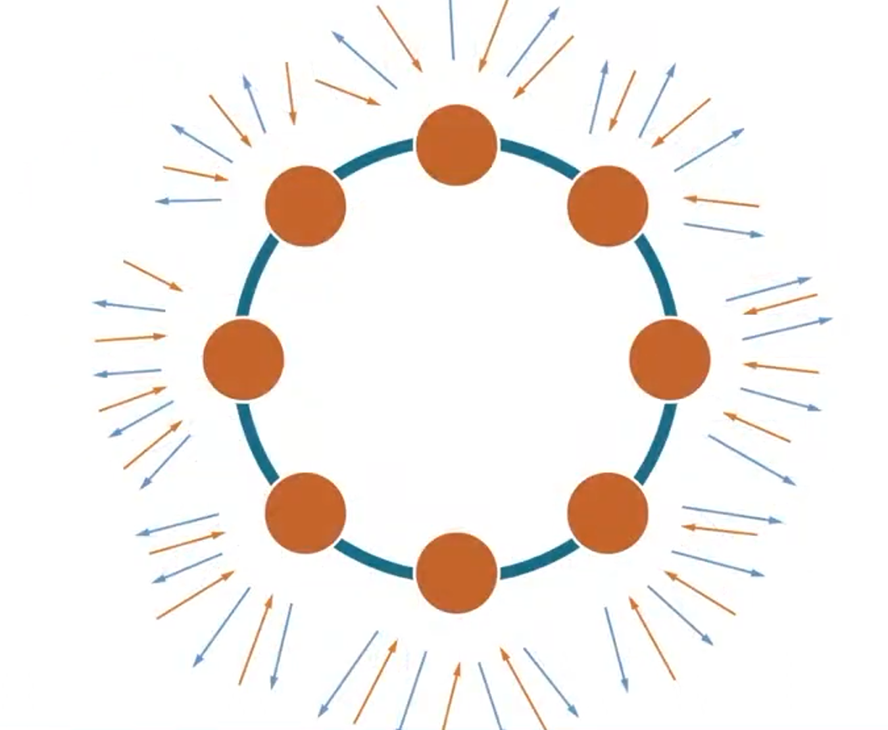

When you write the data, you can write to **any** node in the ring. This node then becomes a **coordinator node** which has to send the data to the node in the ring that stores the partition of the data.

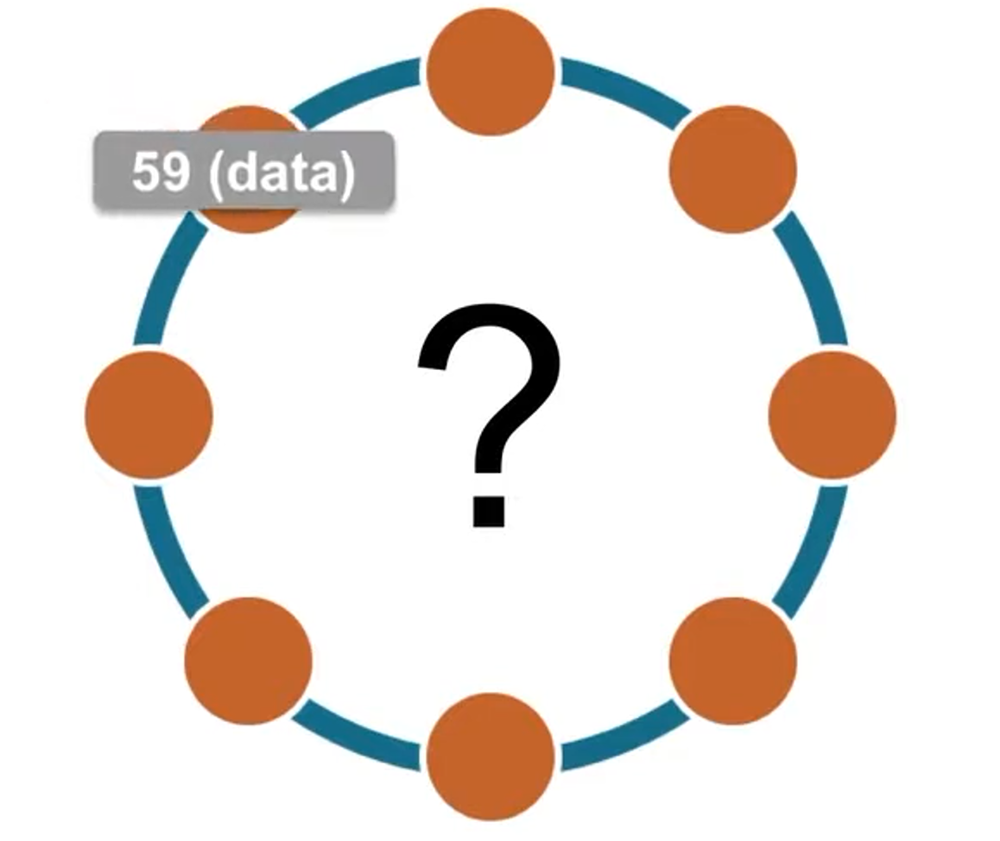

Every node in the ring is responsible for the range of partitions = **token range**

So the coordinator node can send the data to the correct node and after doing this it sends an acknowledgment back to the client

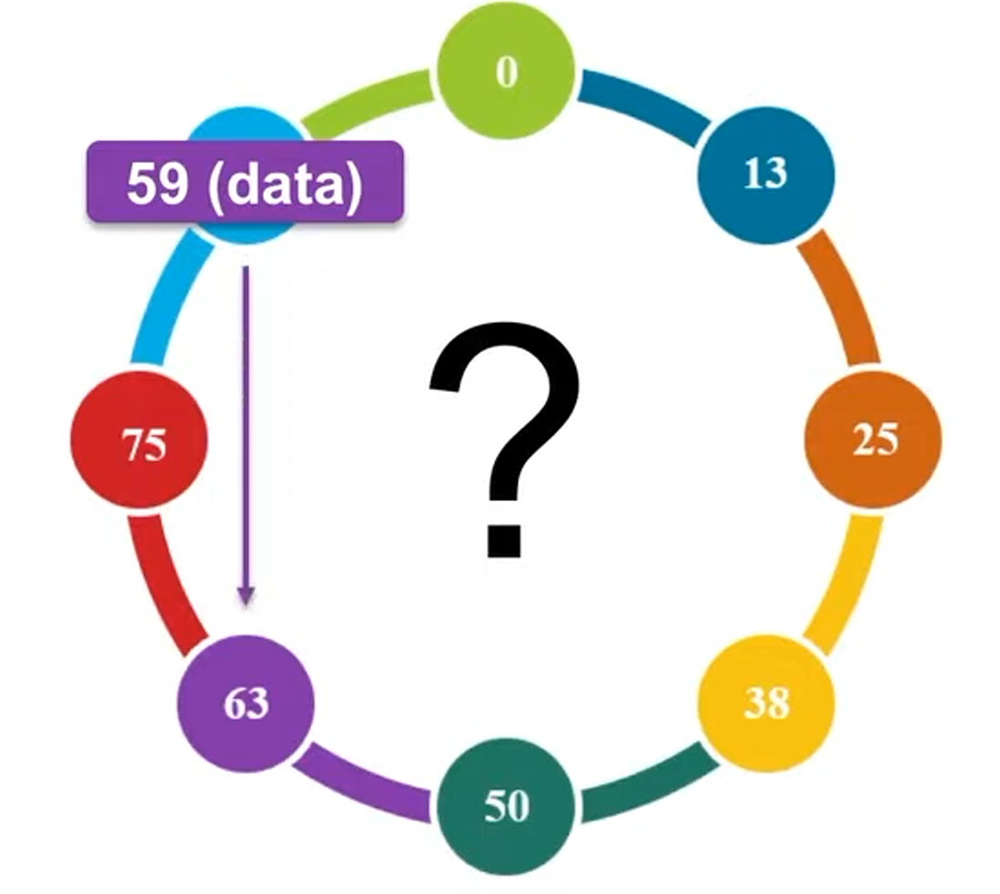

The actual range

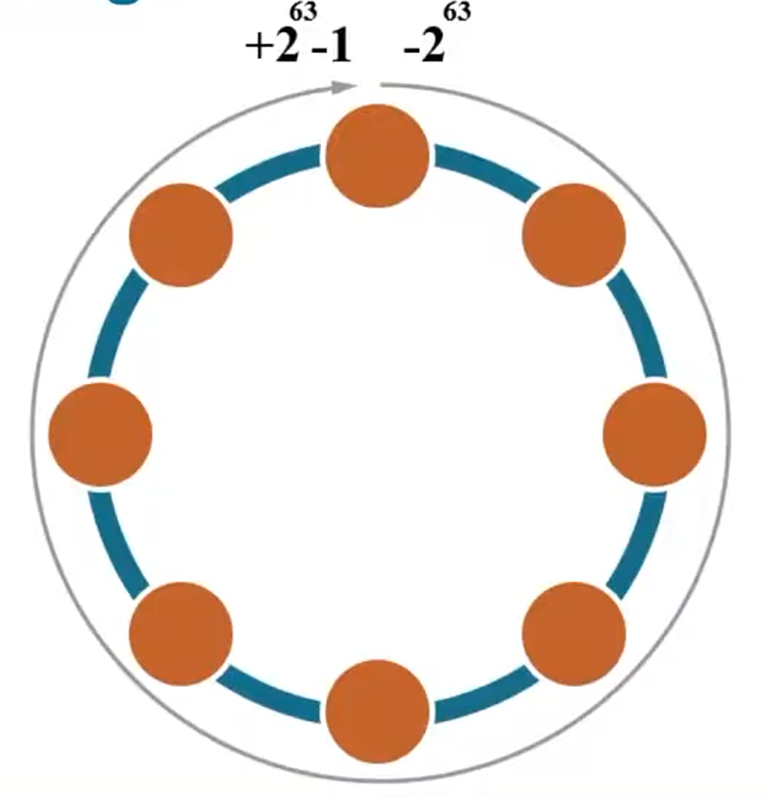

##### Partitioner

The partitioner decides how to distribute your data inside the ring evenly

Default: random but even distribution

##### Node joining the cluster

- Nodes join the cluster by communicating with any node
- Cassandra finds these *seed nodes** list of possible nodes in cassandra.yaml
- Seed nodes communicate cluster topology to the joining node
- Once the new node joins the cluster, all nodes are peers
- **No downtime**
- 4 status: joining, leaving, up, down

##### Drivers

- Drivers intelligently choose which node would best coordinate a request
- Per-query basis:
    ```
    ResultSet results = session.execute("<query>");
    ```
- **TokenAwarePolicy** - driver chooses node which contains the data
- **RoundRobinPolicy** - driver round robins the ring
- **DCAwareRoundRobinPolicy** - driver round robins the target data center

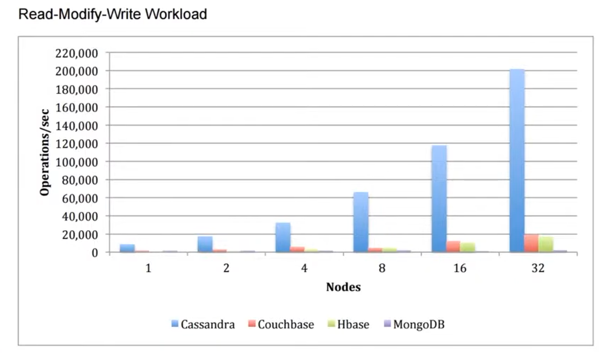

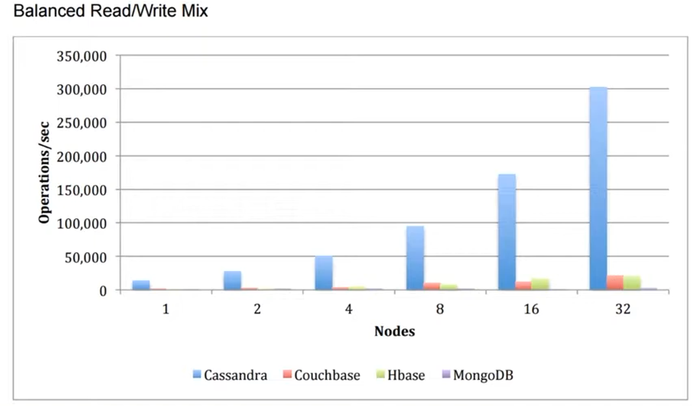

> More nodes -> more capacity without downtime!

##### Horizontal vs. Vertical Scaling

- Vertical scaling requires one large expensive machine
- Horizontal scaling requires multiple less-expensive commodity hardware

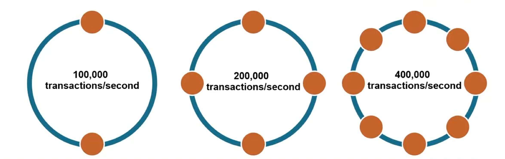

> You can scale up and down as you need with Cassandra

#### Peer to Peer

We have replicas of data in a cluster, and all of the replicas are equal in this peer to peer setup - noone is a leader, noone is a follwer

A split node is NOT a failover event. If the client can see the node, we're still up and running

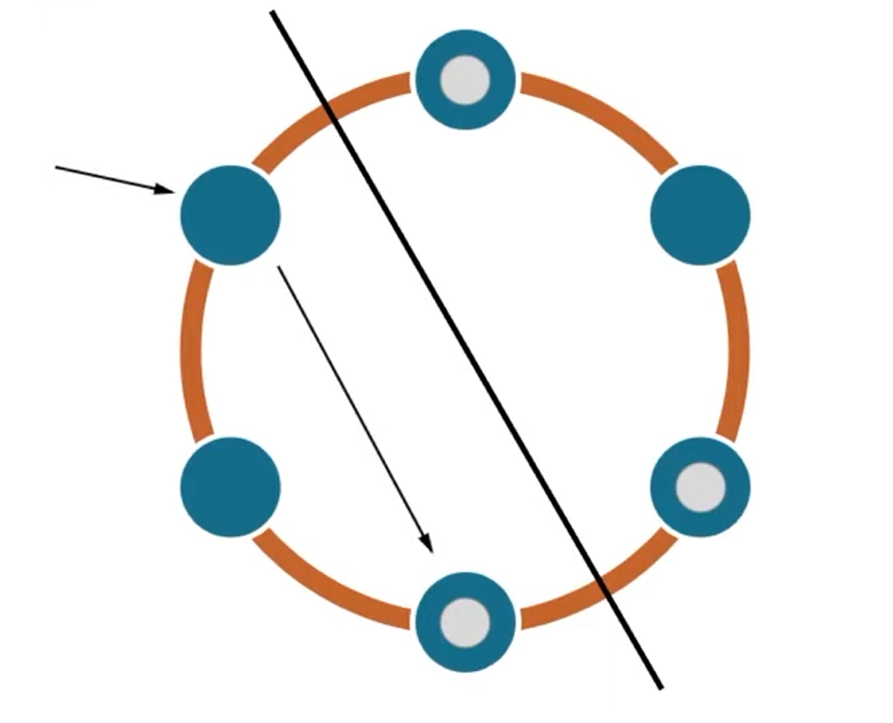

If you write the data to a coordinator node on the other side of the partition, it will write the data to the replicas that it can see (in out example, 2 replicas, so it will write to both of them). This is controlled by the **consistency level**.

#### Vnodes

Adding or removing nodes can make you rsystem unbalanced for some time (because of the uneven spreading of the tokens), cause it requires for the nodes to stream the data to the new nodes.

When it happens, the node overloaded with data has to stream the data to a newly joined node, which puts strain on it. **The Vnode feature helps mitigate this problem**.

> Each physical node acts more like several smaller **virtual nodes**

With Vnodes, each node is responsible for several smaller slices of the ring instead of junst one large slice. Each node is responsible for roughly 1/3 of the data in the ring.

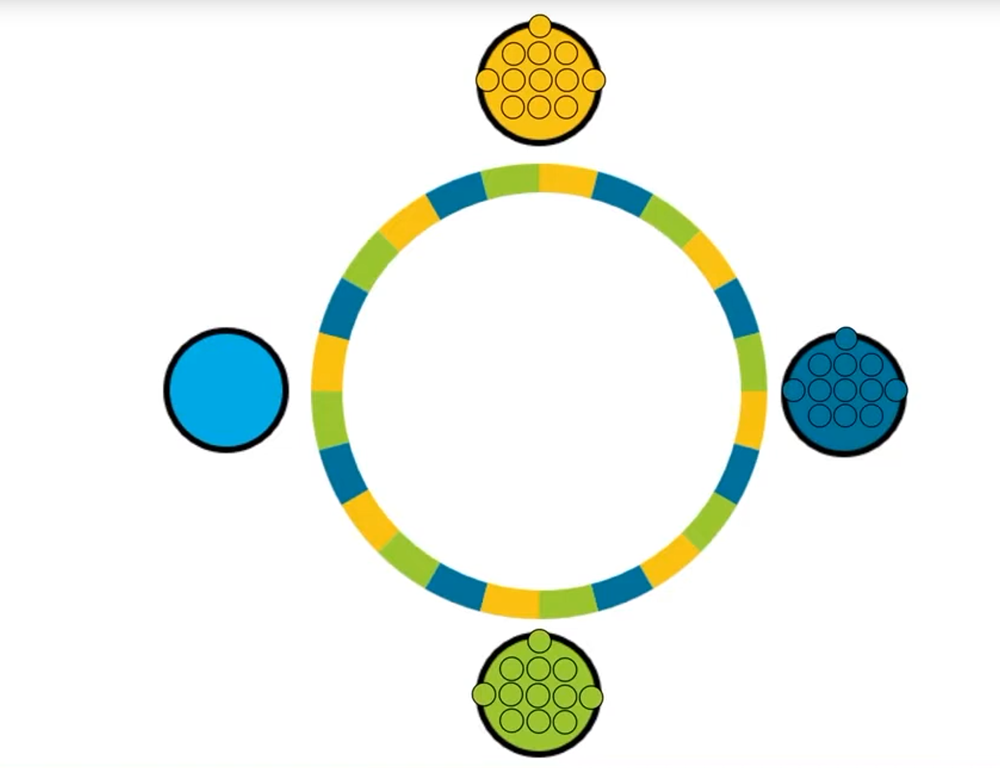

However, what happens is not that the overloaded node just streams the daata to the new node, BUT all of the three nodes streams a piece of the stored data to the new node (in parallel with the other nodes) -> **this makes bootstrapping a new node into the cluster take mch less time**

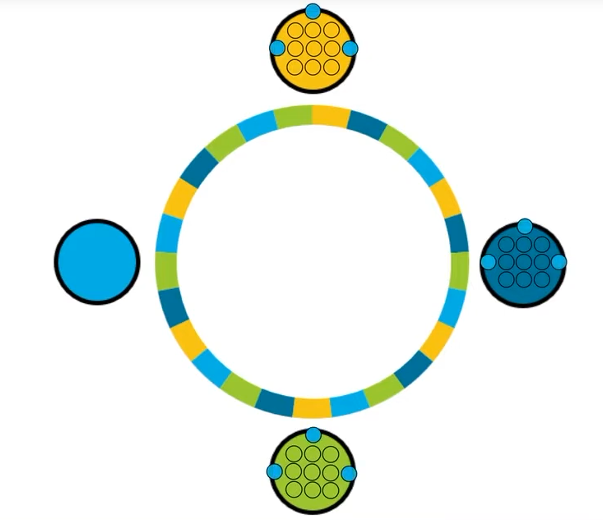

> Vnodes help balance the cluster as new nodes are introduced to it and the old nodes are decomissioned]

##### VNode Details

- adding/removing nodes with vnodes helps keep the cluster balanced
- by default, each node has 128 nodes
- VNodes automate token range assignment

##### Configuration

- Configure vnode settings in cassandra.yaml
- num_tokens
- Value greater than one turns on vnodes

#### Gossip

> A broadcast protocol for disseminating data.

A node can gossip with as many nodes as we like during each round.

##### Choosing a Gossip Node

- Each node initiates a gossip round every second
- Picks one to three nodes to gossip with
- Nodes can gossip with ANY other node in the cluster
- Probabilistically (slightly favor) seed and downed nodes
- Nodes do not track which nodes they gossiped with prior
- Reliably and efficiently spreads node metadata throught he cluster
- Fault tolerant - continues to spread when nodes fail

> Gossip spreads only node metadata, not client data

Each node has an overarching data structure called **Endpoint State**. This essentially stores all the gossip state information for a single node or endpoint.

The Endpoint State nests another data structure caleld the **Heartbeat State**, which tracks 2 values: the **generation** (a timestamp of when the node bootstrapped) and the **version** (simple integer - each node increments its value every second)

The Endpoint State ensts a second data structure called the **Application State**, which stores the metadata for this node (thge data about the node which is spread by gossiping around the cluster). It tracks **status**: BOOTSTRAPPED, NORMAL, LEAVING, LEFT, REMOVING, REMOVED. Nodes declare their own status. It also tracks **DC, RACK, SCHEMA, LOAD** and so on.

Gossip is a simple messagin protocol.

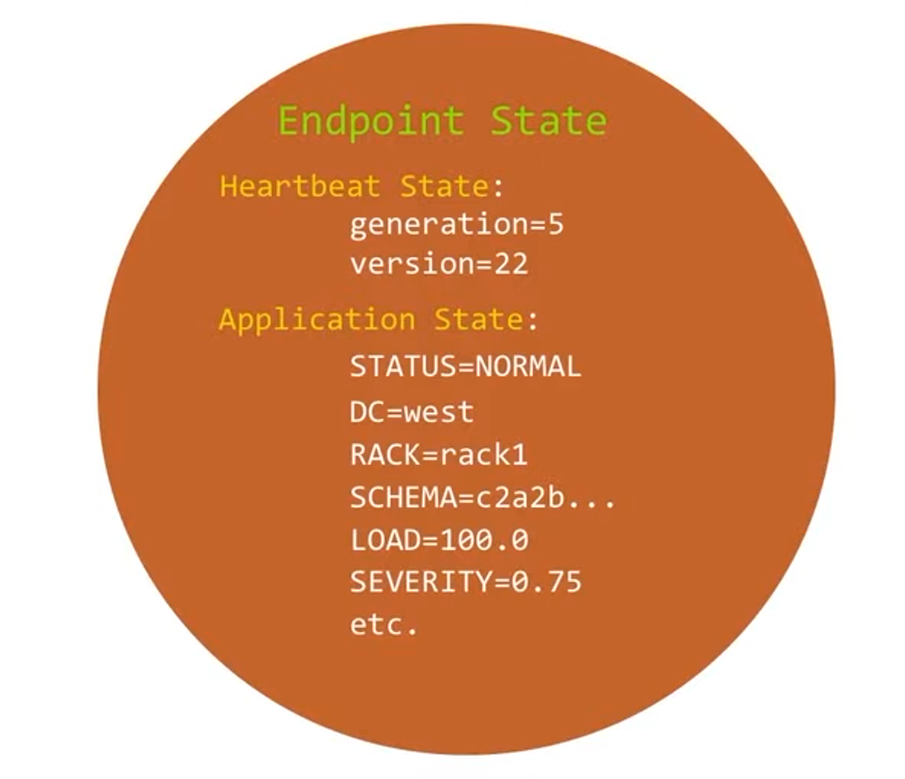

During a gossip round, a node shares the Endpoint Information (Endpoint, Generation and Version) with another node in a SYN message. This second node then compares the information it already has about the endpoints.

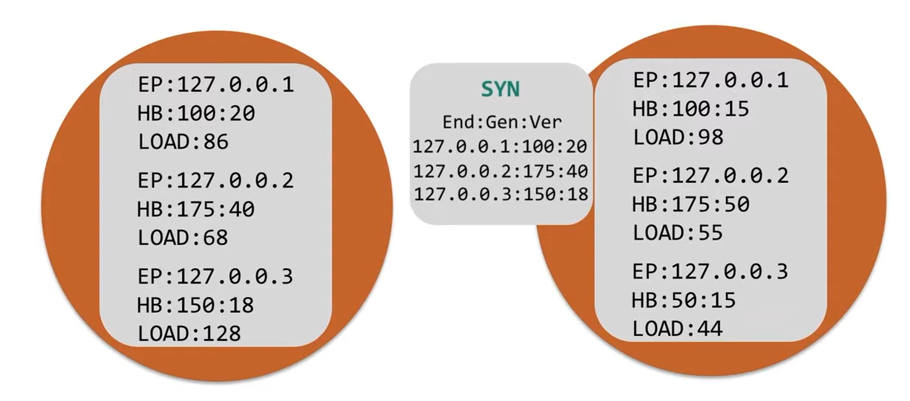

When the information is outdated, the receiving node constructs an ACK message in reply to the sending nodes SYN message where it packs the digest information (endpoint, generation and version). If the node has more up-to-date information about some endpoint, then it store all the information it has about this node in the ACK message instead of a simple digest.

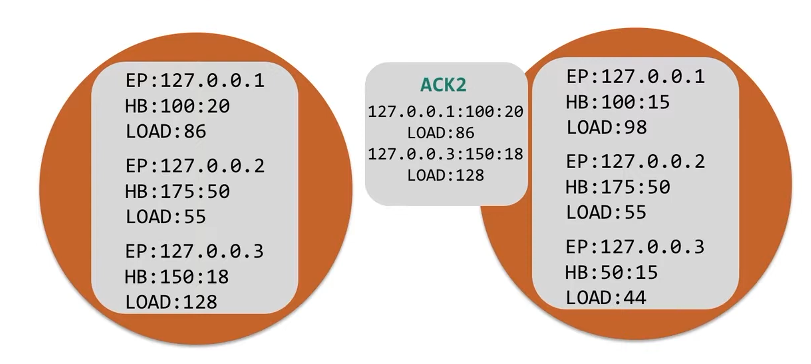

After receiving the ACK message, the initiating node forms an ACK2 message in response with the updated information about the endpoints that have digest information and then updates its data about the endpoints that have more information than just digest. The second nodes updates its data with the new information. The gossip round is complete.

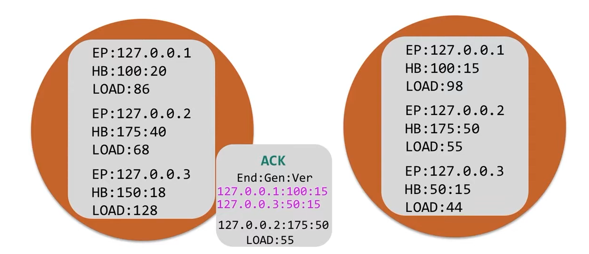

#### Snitch


- Determines/declares each node's rack and data center
- The "topology" of the cluster
- Several different types of snitches
- Configured in cassandra.yaml

```
endpoint_snitch: SimpleSnitch
```

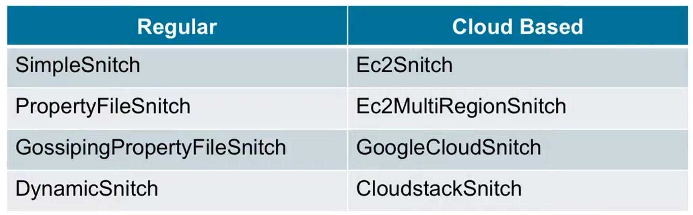

The most popular: **GossipingPropertyFileSnitch**

##### Simple Snitch

- default
- places all nodes in the same data center and rack

Racks and Datacenters are logical node assignments which you usually want to match you reall physical setup.

##### Property File Snitch

- reads datacenter and rack information for all nodes from a file
- you must keep files in sync with all nodes in the cluster
- cassandra-topology.properties file

```
175.56.12.105=DC1:RAC1
175.50.13.200=DC1:RAC1
175.54.35.197=DC1:RAC1

120.53.24.101=DC2:RAC1
120.55.16.200=DC2:RAC1
120.57.18.103=DC2:RAC2

```

- more flexible than a Simple Snitch
- maintaining the config file on each node
- all the config files must be in sync

##### Gossiping Property File Snitch

> Best of both worlds

- relieves the pain of the property file snitch
- declare the current node's DC/rack information in a file
- you must set each individual node's settings
- but you don't have to copy settings as with property file snitch
- gossip spreads the setting through the cluster
- cassandra-rackdc.properties file

```
dc=DC1
rack=RAC1
```

##### Rack Inferring Snitch

- infers the rack and the DC from the IP address

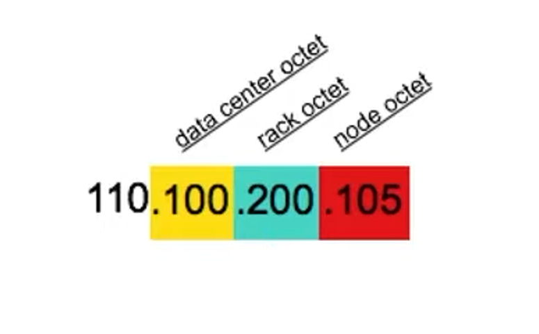

##### Cloud-Based Snitches

*See documentation for details*

- Ec2Snitch
  > Single region Amazon EC2 deployment
- Ec2MultiRegionSnitch
  > Multi-region Amazon EC2 deployment
- GoogleCloudSnitch
  > Multi-region Google cloud deployment
- Cloudstack Snitch
  > For Cloudstack environments

##### Dynamic Snitch

- layered on top of you ractual snitch
- maintains a pulse on each node's performance
- determines which node to query replicas from depending on node health
- turned on by default for all snitches

> Its job is to monitor cluster health and performance

##### Configuring Snitches

- configured in cassandra.yaml file
- all nodes in the cluster use the same snitch
- changing cluster network topology requires restarting all nodes
- run sequential repair and cleanup on each node

#### Replication

> Cassandra replication mechanism is unique and noone else does this

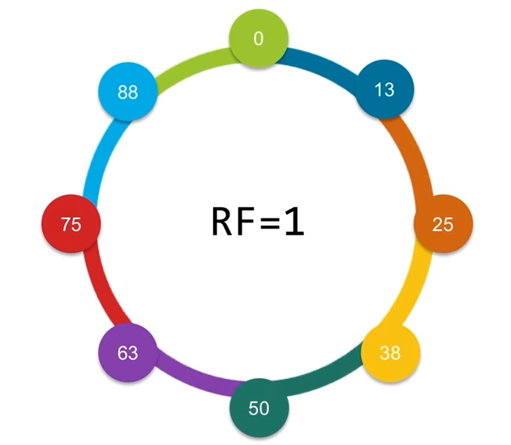

By RF=2 the node stores not only its own data, but also **its neighbours data**

If we have a failure, we avoided the problem of losing the data in that particular node range.

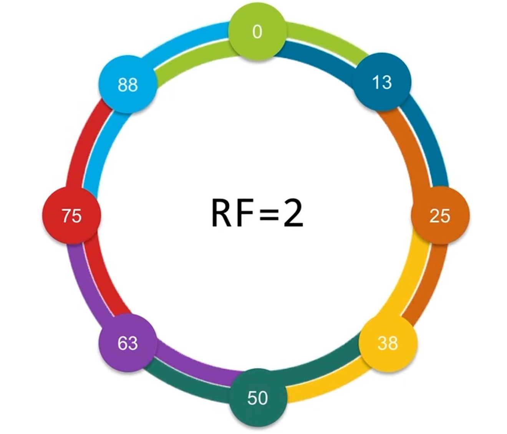

The coordinator is smart enough to copy the data to the correct places where the data lives - that keep sthe data consistent around the ring.

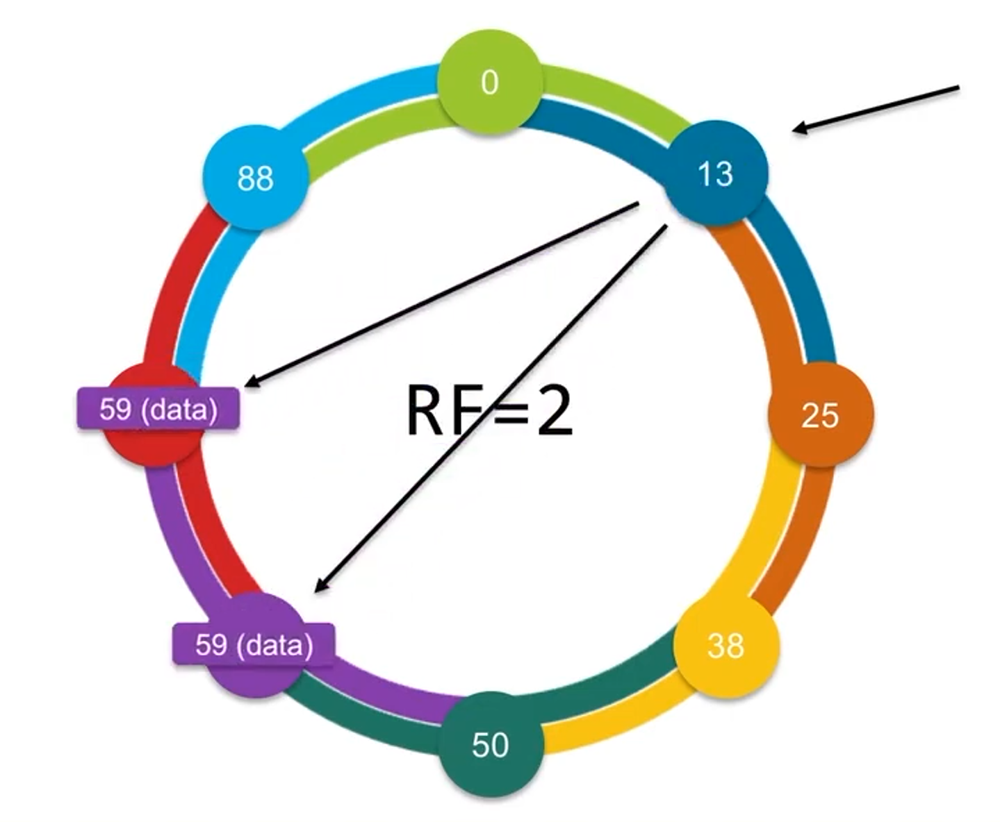

Usually the recommended RF is a RF of 3, because it gives a ggood balance between how much data you're copying meaning the cost, and also just taking advantage of the probability of failure inside of a Cassandra ring.

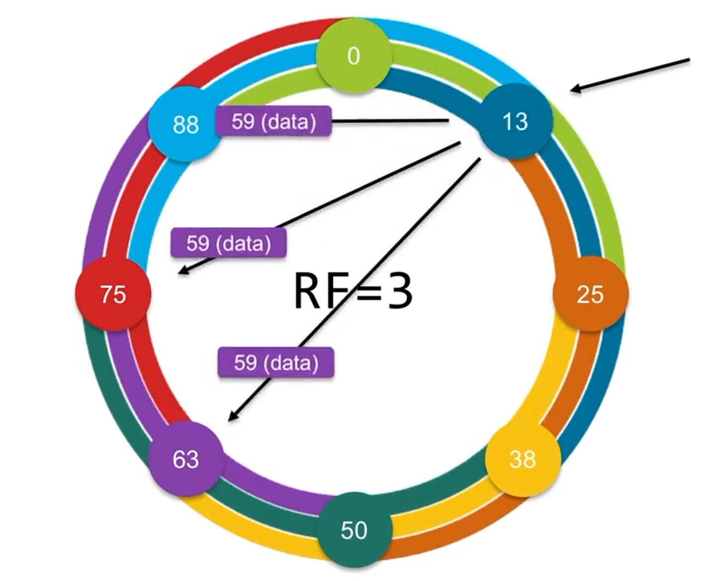

> We're getting a good consistency and can withstand a lot of failure

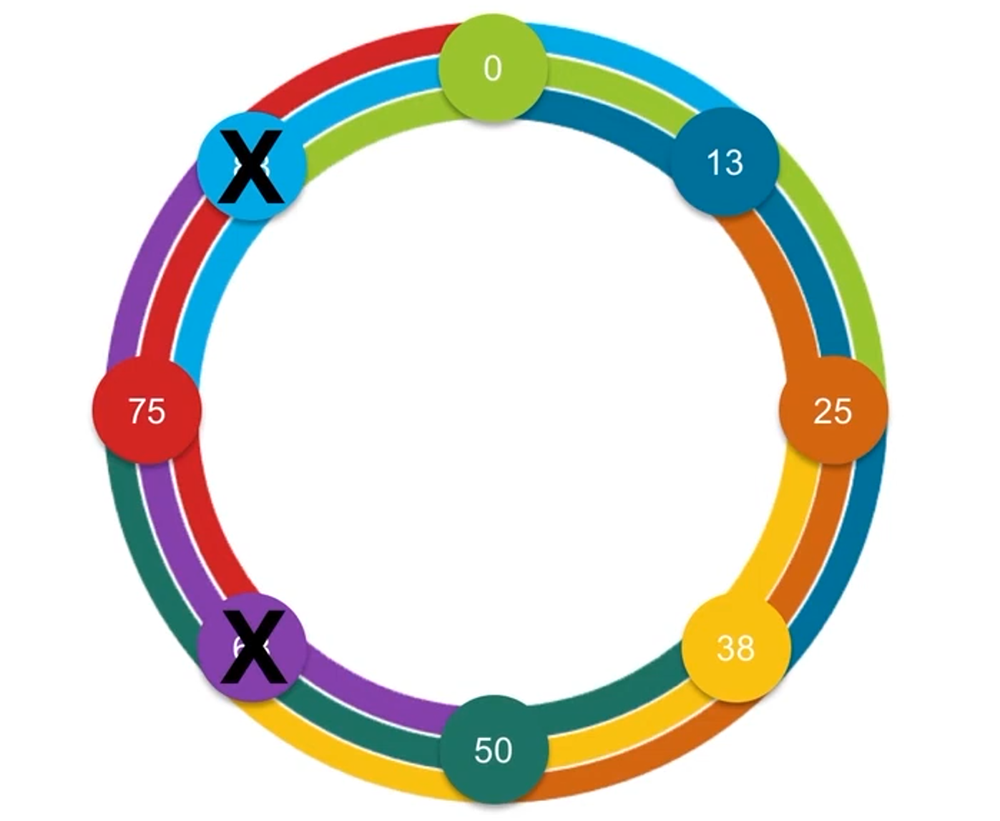

##### Multi-Datacenter Replication

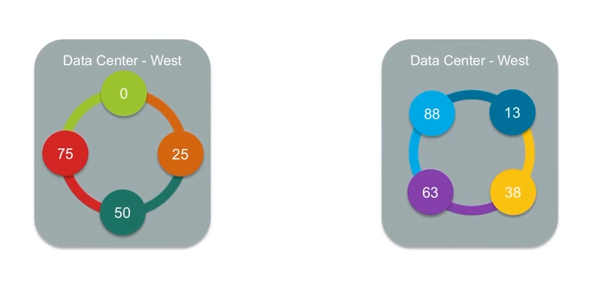

```
CREATE KEYSPACE killrvideo
WITH REPLICATION = {
    'class' : 'NetworkTopologyStrategy',
    'dc-west' : 2, 'dc-east' : 3
}
```

This is realy interestinng as it helps to control data protection environments, when for example, you cannot replicate data into another country, so you can set the RF to 0.

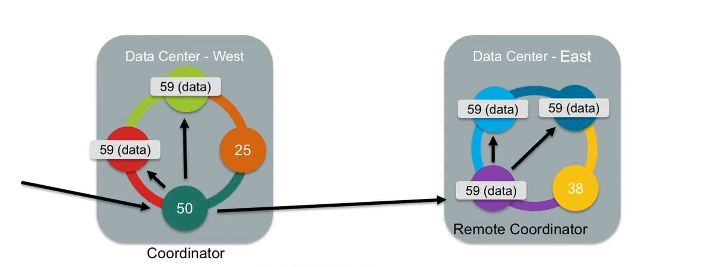

#### Consistency

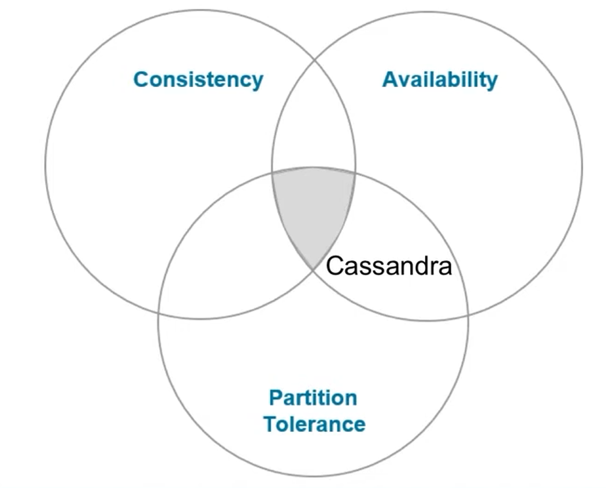

> Cassandra has tunable consistency, but is optimized for availability and partition tolerance.

> How do we know if the data got where it had to go during replication? Through the CL - how many nodes have to acknowledge the write was successful

##### One Datacenter

```
CL=ONE
CL=QUORUM
CL=ALL
```

```CL=ALL``` turns off all of the availability and partition tolerance

```CL=QUORUM (51%)``` is known as strongly consistent and is recommended for use. Strong consistency means that I am reading the data that I've just put into the cluster.

When we have a write ```CL=ALL```, that means that we only need a read ```CL=ONE```, because we can be sure that the data got to all of the nodes.

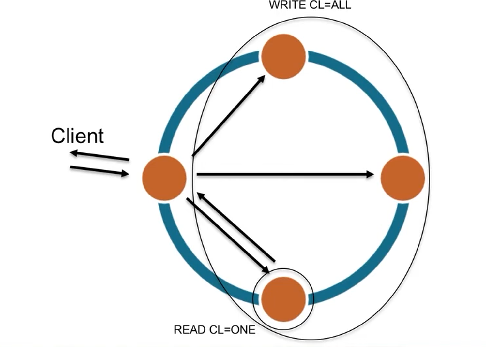

We we have write ```CL=QUORUM```, we will need to read also at ```CL=QUORUM```to ensure strong consistency.

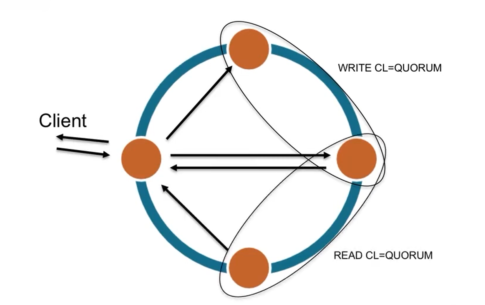

Not necessarily all the data has to be strongly consistent. For such cases, when we just need availability and speed, we use ```CL=ONE```.

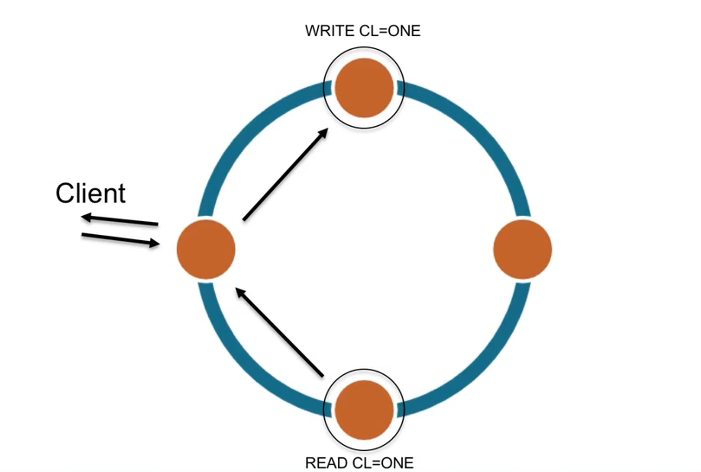

##### Multiple Datacenters

There are specific CL designed for multiple DCs.

For ```CL=QUORUM``` you would need to wait the 51% of all the nodes (including another DC) tor espond, which can result in latency for example

```CL=LOCAL_QUORUM``` is used for ensuring quorum in the local DC only.

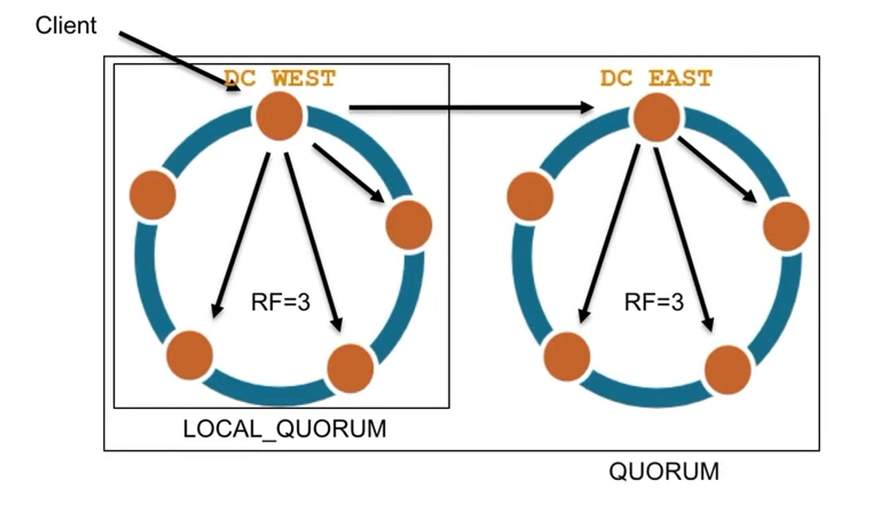

**Multi DC Consistency Settings (from weakest to strongest)**

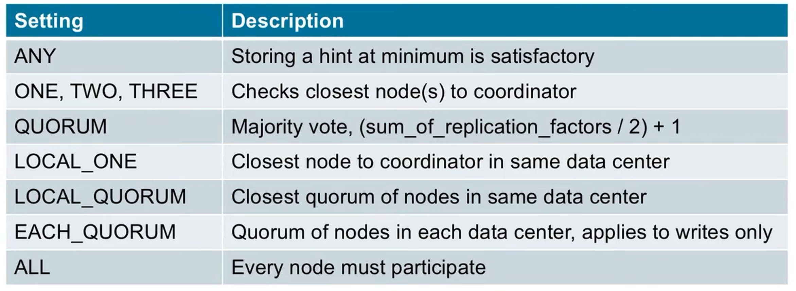

