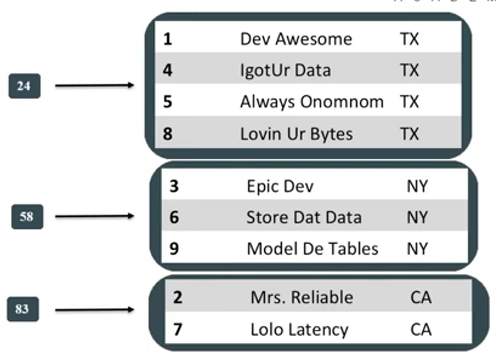

- [DS201: Foundations of Apache Cassandra](#ds201-foundations-of-apache-cassandra)
  - [Quick Wins](#quick-wins)
    - [CQL Fundamentals](#cql-fundamentals)
      - [UUID and TIMEUUID](#uuid-and-timeuuid)
      - [INSERT](#insert)
      - [SELECT](#select)
    - [COPY](#copy)
  - [Partitions](#partitions)
    - [Clustering Columns](#clustering-columns)
      - [Querying Clustering Columns](#querying-clustering-columns)
      - [Changing Default Ordering](#changing-default-ordering)
      - [Allow Filtering](#allow-filtering)

### DS201: Foundations of Apache Cassandra

#### Quick Wins

##### CQL Fundamentals

- CQL
  - Cassandra Query Language
  - Similar to SQL
- Keyspaces
  - Top-level namespace/container
  - Similar to a relational database schema
  - Replication paramteres required
  - USE command switches between keyspaces
- Tables
  - Keyspaces contain tables
  - Tables contain data
- Core datatypes
  - text
    - UTF* encoded string
    - varchar is same as text
  - int
    - signed
    - 32 bits
  - timestamp
    - date and time
    - 64 bit integer
    - Stores number of seconds since Jan. 1, 1970 00.00.00 GMT

###### UUID and TIMEUUID

> Used in place of integer IDs because Cassandra is a distributed database

- Universally Unique Identifier:
  - Ex.: 550e8400-e29b-41d4-a716-446655440000
  - generate via uuid()
- TIMEUUID embeds a TIMESTAMP value
  - Ex.: 550e8400-e29b-41d4-a716-446655440000
  - sortable
  - Generate via row()

###### INSERT

> similar to relational syntax

```sql
INSERT into users (user_id, first_name, last_name) VALUES (uuid(), 'Joseph', 'Chu');
```

###### SELECT

> similar to relational syntax

```sql
SELECT * from users;
SELECT first_name, last_name FROM users;
SELECT * from users WHERE user_id = 550e8400-e29b-41d4-a716-446655440000;
```

##### COPY

- Imports/exports CSV (comma-separated values)

```sql
COPY table1 (column1, column2, column3) FROM 'table1data.csv';
```

- Header parameter skips the first line in the file

```sql
COPY table1 (column1, column2, column3) FROM 'table1data.csv' WITH HEADER=true;
```

- There are several ways to get data into Cassandra:
  - COPY
  - Apache Spark
  - Drivers
  - Etc.
- COPY is prettu primitive
- but COPY is a really good starting point

#### Partitions

> The partition key is how the data is placed on the ring.
> The partition key is turned to a hash number with the help of the consistent hashing function
> The first value in the primary key is ALWAYS a partition key



**Advantage: I always know exactly where my data will go on the ring**

##### Clustering Columns

> The second part of the primary key

- A partition key is not enough for uniqueness of data
- The primary key controls uniqueness
- YOU CAN'T CHANGE THE PRIMARY KEY OF THE EXISTING DATA MODEL
- Choose clustering columns to create **uniqueness** to avoid collisions and overwriting of data

###### Querying Clustering Columns

- You must provide a partition key
- Clustering columns can follow thereafter
- The order of the comparisons in the query should follow the order of clustering columns in the primary key
- You can perform either equality (=) or range queries (<, >) on clustering columns
- All equality comparisons must come before inequality comparisons
- Since data is sorted on disk, range searches are a binary search followed by a linear read

###### Changing Default Ordering

- Clustering columns default ascending order
- Change ordering direction via WITH CLUSTERING ORDER BY
- Must include all columns including and up to the columns you wish to order descending
- For example, we esclude id below and assume ASC

  ```sql
  CREATE TABLE users (
    state text,
    city text,
    name text,
    id uuid,
    PRIMARY KEY ((state), city, name, id))
    WITH CLUSTERING ORDER BY (city DESC, name ASC);
  ```

###### Allow Filtering

- ALLOW FILTERING relaxes the querying on partition key constraint
- You can then query on just clustering columns
- Causes Apache Cassandra to scan all partitions in the table
- Don't use it
  - Unless you really have to
  - Best on small data sets


