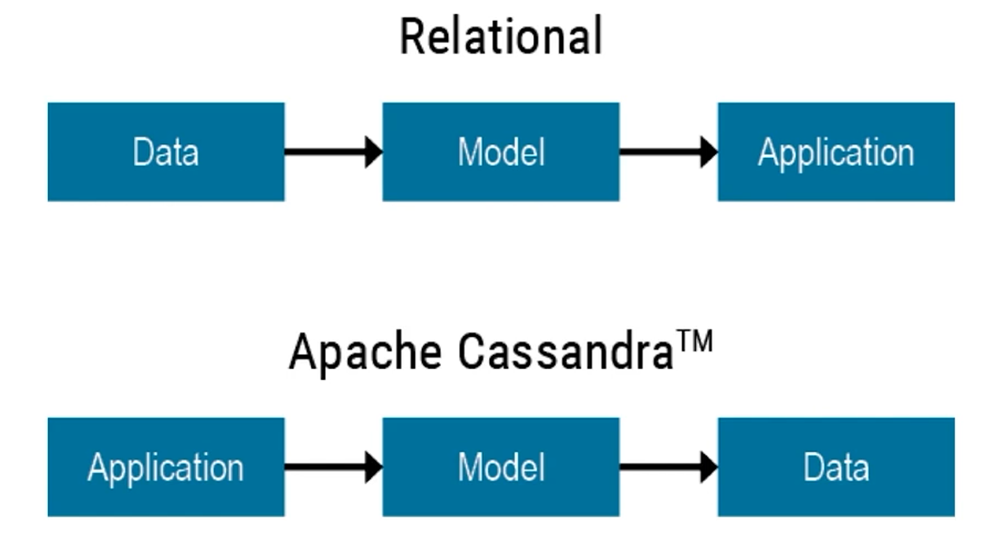

- [DS220: Data Modelling with Apache Cassandra](#ds220-data-modelling-with-apache-cassandra)
  - [Data Modelling Overview](#data-modelling-overview)
  - [Relational vs. Apache Cassandra](#relational-vs-apache-cassandra)
    - [Relational Data Modelling Methodology](#relational-data-modelling-methodology)
    - [Cassandra Data Modelling Methodology](#cassandra-data-modelling-methodology)
    - [Transactions and ACID Compliance](#transactions-and-acid-compliance)
    - [Apache Cassandra and CAP Theorem](#apache-cassandra-and-cap-theorem)
    - [Apache Cassandra and Denormalization](#apache-cassandra-and-denormalization)
      - [Relational Joins](#relational-joins)
      - [Referential Integrity - Relational](#referential-integrity---relational)
  - [Working with KillrVideo](#working-with-killrvideo)
    - [Problems KillrVideo Faces](#problems-killrvideo-faces)
    - [Solutions attempted - Relational](#solutions-attempted---relational)

### DS220: Data Modelling with Apache Cassandra

#### Data Modelling Overview

- Analyze requirements of the domain
- Identify entities and relationships - **Conceptual Data Model**
- Identify queries - **Workflow and Access Patterns**
- Specify the schema - **Logical Data Model**
- Get something working with CQL - **Physical Data Model**
- Optimize and tune

*Data Modelling is a science:*

- Apply tested methodologies
- Make improvements
- Reproducible

*Data Modelling is also an art:*

- Think outside of the box
- Non-standard solution - requires creativity
- Be careful - different data models have different costs

> Main principle: design tables that support the queries.

#### Relational vs. Apache Cassandra

##### Relational Data Modelling Methodology

(one of many)

##### Cassandra Data Modelling Methodology

> We consider Application Workflow earlier in the process and incorporating that analysis into the Logical Data Modelling Phase rather than waiting until we're optimizing a Physical Relational Model.

##### Transactions and ACID Compliance

*Relational DB are ACID compliant*

**Cassandra doesn't support ACID semantics.**

- ACID causes a significant performance penalty
- Not required for many use cases
- However, a single Cassandra write operation demonstrates ACID properties
  - INSERTs, UPDATEs and DELETEs are atomic, isolated and durable
  - Tunable consistency for data replicated to nodes, but does not handle application integrity constraints

##### Apache Cassandra and CAP Theorem

- by default, Cassandra is an AP database
- However, this is tunable with CL
- By tuning CL, you can make more CP than AP
- However! Cassandra isn't designed to be CA because you can't sacrifice partition tolerance

This is often referred as **tunable consistency**

##### Apache Cassandra and Denormalization

###### Relational Joins

> Joining users to comments table

A join performs well when all of the relevant data is available on a single node. The main problem with joins in the distributed system is that the referenced data would most often exist on another node, which can have an unpredictable impact on the latency as the database scale increases.

###### Referential Integrity - Relational

Joins rely on referential integrity constraints to combine data

- a value in one table requires the same value to exist in another table
- if there is a user in table `users_by_email` then the user must also exist in table `users`

**Referential Integrity is not guaranteed by Cassandra, instead, we have to enforce it on the application level.**

- Due to performance reasons - would require a read before a write
- Not an issue that has to be fixed on the Apache Cassandra side
- Referential integrity can be enforced in an application design - more work for developers

OR

- Run DSE Analytics with Apache Spark to validate that duplicate data is consistent

#### Working with KillrVideo

##### Problems KillrVideo Faces

- **Scalability** - Must be able to support constant addition of new users and videos
- **Reliability** - Must always be available
- **Ease of use** - Must be easy to manage and maintain

##### Solutions attempted - Relational

- single points of failure (when the DB crashes)
- scaling complexity
- reliability issues
- difficult to serve users worldwide (lag)

