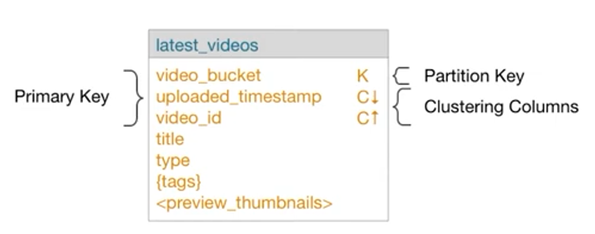

- [DS220: Data Modelling with Apache Cassandra](#ds220-data-modelling-with-apache-cassandra)
  - [Data Modelling Overview](#data-modelling-overview)
  - [Relational vs. Apache Cassandra](#relational-vs-apache-cassandra)
    - [Relational Data Modelling Methodology](#relational-data-modelling-methodology)
    - [Cassandra Data Modelling Methodology](#cassandra-data-modelling-methodology)
    - [Transactions and ACID Compliance](#transactions-and-acid-compliance)
    - [Apache Cassandra and CAP Theorem](#apache-cassandra-and-cap-theorem)
    - [Apache Cassandra and Denormalization](#apache-cassandra-and-denormalization)
      - [Relational Joins](#relational-joins)
      - [Referential Integrity - Relational](#referential-integrity---relational)
  - [Working with KillrVideo](#working-with-killrvideo)
    - [Problems KillrVideo Faces](#problems-killrvideo-faces)
    - [Solutions attempted - Relational](#solutions-attempted---relational)
  - [Apache Cassandra Terminology](#apache-cassandra-terminology)
    - [Basic terms and definitions](#basic-terms-and-definitions)
    - [Text Data Types](#text-data-types)
    - [Integer Data Types](#integer-data-types)
    - [Time, timestamp and unique identifiers](#time-timestamp-and-unique-identifiers)
    - [Specialty Types](#specialty-types)
  - [Partitioning and Storage Structure](#partitioning-and-storage-structure)
  - [Clustering Columns](#clustering-columns)
    - [WITH CLUSTERING ORDER BY](#with-clustering-order-by)
    - [Querying Clustering Columns](#querying-clustering-columns)
  - [Denormalization](#denormalization)
  - [Collection Columns](#collection-columns)
    - [SET Collection Type](#set-collection-type)
    - [LIST Collection Type](#list-collection-type)
    - [MAP Collection Type](#map-collection-type)
    - [FROZEN](#frozen)
  - [UDT - User Defined Type](#udt---user-defined-type)
  - [Counters](#counters)
    - [Counter Considerations](#counter-considerations)
  - [User Defined Functions (UDFs) and User Defined Aggregates (UDAs)](#user-defined-functions-udfs-and-user-defined-aggregates-udas)
    - [UDFs](#udfs)
    - [UDAs](#udas)
    - [Querying with a UDF and a UDA](#querying-with-a-udf-and-a-uda)
  - [Conceptual Data Modeling](#conceptual-data-modeling)
    - [Purpose of Conceptual Modeling](#purpose-of-conceptual-modeling)
    - [Attribute Types](#attribute-types)
    - [Key Attributes](#key-attributes)
    - [Composite Attributes](#composite-attributes)
    - [Multi-Valued Attributes](#multi-valued-attributes)
    - [Entity-Relationship (ER) Model](#entity-relationship-er-model)
    - [Cardinality](#cardinality)
    - [Relationship Keys](#relationship-keys)
    - [Weak Entity Types](#weak-entity-types)
  - [Aplpication Workflow and Access Patterns](#aplpication-workflow-and-access-patterns)
  - [Mapping Conceptual to Logical Model](#mapping-conceptual-to-logical-model)
    - [Query-Driven Data Modeling](#query-driven-data-modeling)
    - [Chebotko Diagrams](#chebotko-diagrams)
    - [Chebotko Diagram Notation](#chebotko-diagram-notation)
    - [Data Modeling Principles](#data-modeling-principles)
    - [Single Partition Per Query - Ideal](#single-partition-per-query---ideal)
    - [Table Scan/Multi-Table Scan - Anti-Pattern](#table-scanmulti-table-scan---anti-pattern)
  - [Logical Data Modeling](#logical-data-modeling)
    - [Nest Data](#nest-data)
    - [Duplicate Data](#duplicate-data)
    - [Mapping rules of Data Modeling](#mapping-rules-of-data-modeling)
    - [Applying Mapping Rules](#applying-mapping-rules)
  - [Physical Data Modeling](#physical-data-modeling)
    - [CQL COPY Command](#cql-copy-command)
    - [SSTable Loader](#sstable-loader)
    - [DSE Bulk Loader](#dse-bulk-loader)
  - [Analysis and Validation](#analysis-and-validation)
    - [Reasons to change data model](#reasons-to-change-data-model)
  - [Write Techniques](#write-techniques)
    - [Data Consistency with Batches](#data-consistency-with-batches)
    - [Misconceptions about batches](#misconceptions-about-batches)
    - [Lightweight Transactiosn](#lightweight-transactiosn)
  - [Read Techniques](#read-techniques)
    - [Secondary Indexes](#secondary-indexes)
    - [Materialized Views](#materialized-views)
    - [Data Aggregation](#data-aggregation)
  - [Table/Key Optimizations](#tablekey-optimizations)
    - [Table Optimizations](#table-optimizations)
  - [Data Model Migration](#data-model-migration)
    - [Primary Key Changes](#primary-key-changes)
    - [Creating new tables](#creating-new-tables)
  - [Data Modeling Anti-Patterns](#data-modeling-anti-patterns)
    - [Query Specific Anti Patterns](#query-specific-anti-patterns)
    - [Table Specific Anti-Patterns](#table-specific-anti-patterns)
    - [Keyspace Level Anti-Patterns](#keyspace-level-anti-patterns)
  - [Data Modeling Use Cases](#data-modeling-use-cases)
    - [Use Case 1: Shopping cart](#use-case-1-shopping-cart)
    - [Use Case 2: user Profile Data](#use-case-2-user-profile-data)
    - [Use Case 3: Sensor Event Tracking](#use-case-3-sensor-event-tracking)


### DS220: Data Modelling with Apache Cassandra

#### Data Modelling Overview

- Analyze requirements of the domain
- Identify entities and relationships - **Conceptual Data Model**
- Identify queries - **Workflow and Access Patterns**
- Specify the schema - **Logical Data Model**
- Get something working with CQL - **Physical Data Model**
- Optimize and tune


*Data Modelling is a science:*

- Apply tested methodologies
- Make improvements
- Reproducible

*Data Modelling is also an art:*

- Think outside of the box
- Non-standard solution - requires creativity
- Be careful - different data models have different costs

> Main principle: design tables that support the queries.

#### Relational vs. Apache Cassandra


##### Relational Data Modelling Methodology

(one of many)


##### Cassandra Data Modelling Methodology


> We consider Application Workflow earlier in the process and incorporating that analysis into the Logical Data Modelling Phase rather than waiting until we're optimizing a Physical Relational Model.


##### Transactions and ACID Compliance

*Relational DB are ACID compliant*


**Cassandra doesn't support ACID semantics.**

- ACID causes a significant performance penalty
- Not required for many use cases
- However, a single Cassandra write operation demonstrates ACID properties
  - INSERTs, UPDATEs and DELETEs are atomic, isolated and durable
  - Tunable consistency for data replicated to nodes, but does not handle application integrity constraints

##### Apache Cassandra and CAP Theorem


- by default, Cassandra is an AP database
- However, this is tunable with CL
- By tuning CL, you can make more CP than AP
- However! Cassandra isn't designed to be CA because you can't sacrifice partition tolerance

This is often referred as **tunable consistency**

##### Apache Cassandra and Denormalization

###### Relational Joins

> Joining users to comments table


A join performs well when all of the relevant data is available on a single node. The main problem with joins in the distributed system is that the referenced data would most often exist on another node, which can have an unpredictable impact on the latency as the database scale increases.


###### Referential Integrity - Relational

Joins rely on referential integrity constraints to combine data

- a value in one table requires the same value to exist in another table
- if there is a user in table `users_by_email` then the user must also exist in table `users`


**Referential Integrity is not guaranteed by Cassandra, instead, we have to enforce it on the application level.**

- Due to performance reasons - would require a read before a write
- Not an issue that has to be fixed on the Apache Cassandra side
- Referential integrity can be enforced in an application design - more work for developers

OR

- Run DSE Analytics with Apache Spark to validate that duplicate data is consistent

#### Working with KillrVideo


##### Problems KillrVideo Faces

- **Scalability** - Must be able to support constant addition of new users and videos
- **Reliability** - Must always be available
- **Ease of use** - Must be easy to manage and maintain

##### Solutions attempted - Relational

- single points of failure (when the DB crashes)
- scaling complexity
- reliability issues
- difficult to serve users worldwide (lag)

#### Apache Cassandra Terminology

##### Basic terms and definitions

**Data Model**
- an abstract model for organizing elements of data
- based on the queries you want to perform

**Keyspace**
- similar to relational schema - outermost grouping of data
- all tables live inside a keyspace
- keyspace is the container for replication

**Table**
- grouped into keyspaces
- contain columns

**Partition**
- rows of data that are stored on a particular node in your based on a partitioning strategy

More specific to the tables themselves

**Row**
- one or more CQL rows stored together on a partition

**Column**
- similar to a column in a relational database
- **primary key**: used to access the data in a table and guarantees uniqueness

**Partition key**
- defines the node on which the data is stored

**Clustering Column**
- defines the roder of rows **within** a partition

##### Text Data Types

- **Ascii**: US-ASCII characters
- **Text**: UTF-8 encoded string
- **Varchar**: UTF-8 encoded string

##### Integer Data Types

- **Tinyint**: 8-bit signed integer
- **Smallint**: 16-bit signed integer
- **Int**: 32-bit signed integer
- **Bigint**: 64-bit signed integer
- **Varint**: Arbitrary-precision integer - F-8 encoded string
- **Decimal**: Variable-precision decimal, supports integers and floats
- **Float**: 32-bit IEEE-754 floating point
- **Double**: 64-bit IEEE-754 floating point

##### Time, timestamp and unique identifiers

- **Date**: 32-bit unsigned integer - number of days since epoch (Jan 1, 1970)
- **Duration**: Signed 64-bit integer - amount of time in nanoseconds
- **Time**: Encoded 64-bit signed - number of nanoseconds since midnight
- **Timestamp**: 64-bit signed inteer - date and time since epoch in milliseconds
- **UUID**: 128-bit universally unique identifier - generate with the UUID function
- **TimeUUID**: unique identifier that includes a "conflict-free" timesdtamp - generate with the NOW function

##### Specialty Types

- **Blob**: Arbitrary bytes (no validation), expressed as hexadecimal
- **Boolean**: Stored internally as true or false
- **Counter**: 64-bit signed integer - only one counter column is allowed per table
- **Inet**: IP address string in IPv4 or IPv6 format

#### Partitioning and Storage Structure


CQL's PARTITION KEY clause determines partitioning criteria in the primary key

**WHERE on non-primary key columns**

- Cassandra distributes partitions across nodes
- WHERE on any field other than partition key would require a scan of all partitions on all nodes
- Inefficient access pattern


**WHERE on partition key values**
- We can WHERE on a partition key value as well as clustering columns
- Cassandra uses a hashing algorithm to quicly determine which node(s) contain the desired partition


**Primary Key**

Simple Primary Key

- contains only the partition key
- determines which node stores the data
-


**Composite Partition Keys**

Multi-value primary key


**Primary Key vs. Partition Key**

- **Partition key**: the part of the primary key that determines what node the partition is stored on; where in the cluster is my data
- **Primary key**: includes partition key and any/all clustering columns; uniqueness
- Can they be the same? Yes! But not usually.

#### Clustering Columns

- come after partition key within PRIMARY KEY clause
- data displays the same as before


Clustering sorts CQL rows in partitions


Clustering column values stored sorted


##### WITH CLUSTERING ORDER BY

```sql
CREATE TABLE videos (
  id int,
  name text,
  runtime int,
  year int,
  PRIMARY KEY ((year), name)
) WITH CLUSTERING ORDER BY (name DESC);
```

##### Querying Clustering Columns

> You can query on clustering coumns because lookup is fast

```sql
SELECT * FROM videos WHERE year = 2014 AND name = 'Mockingjay';
```


**Range**

```sql
SELECT * FROM videos WHERE year = 2014 AND name >= 'Interstellar';
```


#### Denormalization

**Typical Relational Structure**


```sql
SELECT comment FROM videos JOIN comments ON videos.id = comments.video_id WHERE title = 'Interstellar';
```


**Denormalizing for Quewry Performance**


```sql
CREATE TABLE comments_by_video (
  video_title text,
  comment_id timeuuid,
  user_id text,
  video_id timeuuid,
  comment text,
  PRIMARY KEY ((video_title), comment_id)
);

CREATE TABLE comments_by_user (
  user_login text,
  comment_id timeuuid,
  user_id text,
  video_id timeuuid,
  comment text,
  PRIMARY KEY ((user_login), comment_id)
);
```

#### Collection Columns

Group and store data together in a column

- collection columns are multi-valued columns
- designed to store a small amount of data
- retrieved in its entirety
- cannot nest a collection inside another collection - unless you use FROZEN

##### SET Collection Type

- typed collection of unique values
- stored unordered, but retrieved in sorted order

```sql
CREATE TABLE users (
  id text PRIMARY KEY,
  fname text,
  lname text,
  emails set<text>
);

INSERT into users (id, fname, lname, emails)
VALUES ('cass123', 'Cassandra', 'Dev', {'cass@dev.com', 'cassd@gmail.net'});
```

##### LIST Collection Type

- like SET - collection of values in same cell
- do not need to be unique and can be duplicated
- stored in a particular order

```sql
ALTER TABLE users ADD freq_dest list<text>;

UPDATE users SET freq_dest = ['Berlin', 'London', 'Paris'] WHERE id = 'cass123';
```

##### MAP Collection Type

- typed collection of key-value pairs - name and pair of typed values
- ordered by unique keys

```sql
ALTER TABLE users ADD todo map<timestamp , text>;

UPDATE users SET todo = {'2018-1-1' : 'create database', '2018-1-2' : 'load data and test', '2018-2-1' : 'move to production'} WHERE id = 'cass123';
```

##### FROZEN

- if you want to nest datatypes, you have to use FROZEN
- using FROZEN in a collection will serialize multiple components into a single value
- values in a FROZEN collection are treated like blobs
- non-frozen types allow updates to individual fields

#### UDT - User Defined Type

Attach multiple data fields to a column

- UDTs group related fields of information
- UDTs can attach multiple data fields, each named and typed, to a single column
- can be any datatype including collections and other UDTs
- allows embedding more complex data within a single column

> Creating the Types

```sql
CREATE TYPE address (
  street text,
  city text,
  zip_code int,
  phones set<text>
);

CREATE TYPE full_name (
  first_name text,
  last_name text
);
```

> Using the newly created types in a table definition

```sql
CREATE TABLE users (
  id uuid,
  name frozen <full_name>,
  direct_reports set<frozen <full_name>>,
  addresses map<text, frozen <address>>,
  PRIMARY KEY ((id))
);
```

#### Counters

- column used to store a 64-bit signed integer
- changed incrementally - incremented or decremented
- values are changed using UPDATE
- need specially dedicated tables - can only have primary key and counter columns
  - can have more than one counter column

```sql
CREATE TABLE moo_counts (
  cow_name text,
  moo_count counter,
  PRIMARY KEY ((cow_name))
);

UPDATE moo_counts SET moo_count = moo_count + 8 WHERE cow_name = 'Betsy';
```

##### Counter Considerations

> Some things to be aware of

- distributed system can cause consistency issues with counters in some cases
- cannot INSERT or assign values - default value is "0"
- must be only non-primary key column(s)
- not idempotent
- must use UPDATE command - DataStax Enterprise rejects USING TIMESTAMP or USING TTL to update counter columns
- counter columns cannot be indexed or deleted

#### User Defined Functions (UDFs) and User Defined Aggregates (UDAs)

##### UDFs

- write custom functions using Java and JavaScript
- use in SELECT, INSERT and UPDATE statements
- functions are only available within the keyspace where it is defined

**Creating UDFs Syntax**

Enabled by changing the following settings in the `cassandra.yaml` file

- Java: set `enable_user_defined_functions` to true
- JavaScript and other custom languages: set `enable_scripted_user_defined_functions` to true

##### UDAs

- DataStax Enterprise allows users to define aggregate functions
- functions are applied to data stored in a table as part of a query result
- the aggregate function must be created prior to its use in a SELECT statement
- query must only include trhe aggregate function itself - no additional columns

```sql
CREATE OR REPLACE
  FUNCTION avgState (state tuple<int,float>, val float)
  CALLED ON NULL INPUT
  RETURNS tuple<int, float>
  LANGUAGE java
  AS 'if (val != null) {
    state.setInt(0, state.getInt(0)+1);
    state.setFloat(1, state.getFloat(1)+val.floatValue());
  }
  return state;';

CREATE OR REPLACE
  FUNCTION avgFinal (sate tuple <int, float>)
  CALLED ON NULL INPUT
  RETURNS float
  LANGUAGE java
  AS 'float r = 0;
  if (state.getInt(0) == 0) return nul;
    r = state.getFloat(1);
    r/= state.getInt(0);
  return Float.valueOf(r);';

  CREATE AGGREGATE
    IF NOT EXISTS average (float);
    SFUNC avgState
    STYPE tuple<int,float>
    FINALFUNC avgFinal
    INITCOND (0,0);
  ```

##### Querying with a UDF and a UDA

- the state function is called once for each row
- the value returned by the state function becomes the new state
- after all rows are processed, the optional final function is executed with the last state value as its argument
- aggregation is performed by the coordinator

```sql
SELECT average(avg_rating) FROM videos WHERE release_year = 2002 ALLOW FILTERING;
SELECT average(avg_rating) FROM videos WHERE release_year = 2002 ALLOW FILTERING;
SELECT average(avg_rating) FROM videos WHERE release_year = 2002 ALLOW FILTERING;
SELECT average(avg_rating) FROM videos WHERE genres CONTAINS 'Romance' ALLOW FILTERING;
```

#### Conceptual Data Modeling

> Modeling your domain


- abstract view of your domain
- technology independent
- not specific to anyd atabase system


##### Purpose of Conceptual Modeling

- understand your datas
- essential objects
- constraints

##### Attribute Types

- fields to store data about an entty or relationship

##### Key Attributes

- identifies an object


##### Composite Attributes

- groups related attributes together


##### Multi-Valued Attributes

- attribute stores multiple values per entity


##### Entity-Relationship (ER) Model

- Entity Types - Relationship Types - Attribute Types


##### Cardinality

- relationships between entities
- number of times an entity can/must participate in the relationship
- other possibilities
  - 1-n
  - 1-1


##### Relationship Keys


##### Weak Entity Types

- cannot exist without an identifying relationship to a strong entity type


#### Aplpication Workflow and Access Patterns


- each application has a workflow - tasks/causal dependencies form a graph
- access patterns help determine how data is acessed - know what queries you will run first
- example task: have a user login to a site

Task: show videos that were uploaded by a particular user


#### Mapping Conceptual to Logical Model

##### Query-Driven Data Modeling


##### Chebotko Diagrams

- graphical representation of Cassandra database schema design
- documents the logical and physical data model


##### Chebotko Diagram Notation

> Table representation

- logical-level shows column names and properties
- physical-level also shows the column data type
-


> Logical UDT Diagram

- represents user defined types and tuples


> Physical UDT Diagram

- represents user defined types and tuples


Example Chebotko Diagram


##### Data Modeling Principles

- **know your data**
  - data captured by conceptual data model
  - define what is stored in database
  - preserve properties so that data is organized properly
  - 
- **know your queries**
  - queries captured by application workflow model
  - table schema design changes if queries change
  - 
- **nest data**
- **duplicate data**

##### Single Partition Per Query - Ideal

> Schema design organizes data to efficiently run queries

- most efficient access pattern
- query accesses only one partition to retrieve results
- partition can be single-row or multi-row

##### Table Scan/Multi-Table Scan - Anti-Pattern

- least efficient type of query but may be needed in some cases
- query needs to access all partitions in a table(s) to retrieve results

#### Logical Data Modeling

##### Nest Data

> Data nesting is the main data modeling technique

- nesting organizes multiple entities into a single partition
- supports partition per query data access
- three data nesting mechanisms:
  - **clustering columns - multi-row partitions**
    > primary data nesting mechanism
    - partition key identifies an entity that other entitites will nest into
    - values in a clustering column identify the nested entities
    - multiple clustering columns implement multi-level nesting
    

  - **collection columns**
  - **user-defined type columns**
    > User-defined type - secondary data nesting mechanism
    - represents one-to-one relationship, but can use in conjunction with collections
    - easier than working with multiple collection columns
    

##### Duplicate Data

> Better to duplicate than to join

- partition per query and data nestimg may result in data duplication
- query results are pre-computed and materialized
- data can be duplicated across tables, partitions and/or rows


> Data duplication can scale, joins can not


##### Mapping rules of Data Modeling

1. Entities and relationships
2. Equality search attributes
3. Inequality search attributes
4. Ordering attributes
5. Key attributes

##### Applying Mapping Rules

- create a schema from the conceptual data model and for each query
- apply the mapping rules in order


#### Physical Data Modeling


> Adding data types and creating tables


> Writing the CQL statements


> Loading Data Methods

- COPY command
- SSTable loader
- DSE Bulk Loader

##### CQL COPY Command

- COPY TO exports data from a table to a CSV file
- COPY FROM imports data to a table from a CSV file
- the process verifies the PRIMARY KEY and updates existing records
- if HEADER = false is specified the fileds are imported in deterministic order
- when column names are specified, fields are imported in that order - missing and empty fields set to null
- source cannot have more fields than the target table - can have fewer fields

```sql
COPY table1 (column1, column2, column3) FROM 'table1data.csv' WITH HEADER=true;
```

##### SSTable Loader

- bulk load external data into a cluster
- load pre-existing SSTables into
  - an existing cluster or new cluster
  - a cluster with the same number of nodes or a different number of nodes
  - a cluster with a different replication strategy or partitioner

`sstableloader -d  110.82.155.1 /var/lib/cassandra/data/killrvideo/users/`

##### DSE Bulk Loader

- moves Cassandra data to/from files in the file system
- uses both CSV or JSON formats
- command-line interface
- used for loading large amounts of data fast

`dsbulk load -url file1.csv -k ks1 -t table1`

#### Analysis and Validation


##### Reasons to change data model

- requirements change in the domain
- the data model is no longer efficient
- data is becoming imbalanced
- unforseen load on particular nodes leading to hotspotting

**Changing data model or handling new requirements**

Important considerations:

- natural or surrogate keys?
- are write conflicts (overwrites) possible?
- what data types to use?
- how large are partitions?
- how much data duplication is required?
- are client-side joins required and at what cost?
- are data consistency anomalies possible?
- how to enable transactions and data aggregation?

#### Write Techniques

##### Data Consistency with Batches

> Schema data consistency refers to the correctness of data copies

- with data duplication you need to worry about and handle consistency
- all copies of the same data in your schema should have the same values
- adding, updating or deleting data may require multiple INSERTs, UPDATEs and DELETEs
- logged batches were built for maintaining consistency
- have a documented plan!

> Batch example


- to insert a new video

```sql
INSERT INTO videos (video_id, ...) VALUES (1, ..);
INSERT INTO videos_by_title (title, video_id, ...) VALUES ('Jaw', 1, ...);
```

- to update the title of a video

```sql
UPDATE videos SET title = 'Jaws' WHERE video_id = 1;
INSERT INTO videos_by_title (title, video_id, ...) VALUES ('Jaws', 1, ...);
DELETE FROM videos_by_title WHERE title = 'Jaw' AND video_id = 1;
```

> Example of using logged batch for data consistency

- to insert a new video

```sql
BEGIN BATCH
  INSERT INTO videos (video_id, ...) VALUES (1, ...);
  INSERT INTO videos_by_title (title, video_id, ...) VALUES ('Jaw', 1, ...);
APPLY BATCH;
```
- to update the title of a video

```sql
BEGIN BATCH
  UPDATE videos SET title = 'Jaws' WHERE video_id = 1;
  INSERT INTO videos_by_title (title, video_id, ...) VALUES ('Jaws', 1, ...);
  DELETE FROM videos_by_title WHERE titel = 'Jaw' AND video_id = 1;
APPLY BATCH;
```

- written to a log on the coordinator node and replicas before execution
  - batch succeeds when the writes have been applied or hinted
  - replicas take over if the coordinator node fails mid-batch
- gets us part of the way to ACID transactions
  - no need for a rollback implementation since Cassandra will ensure that the batch succeeds
  - but no batch isolation - clients may read updated rows before the batch completes

##### Misconceptions about batches

- not intended for bulk loading
  - rarely increases performance of data load
  - can overwork the coordinator and cause performance bottlenecks or other issues
- no ordering for operations in batches - all writes are executed with he same timestamp

##### Lightweight Transactiosn

> Compare and Set (CAS) operation with ACID properties

- does a read to check a condition and performs the INSERT/UPDATE/DELETE if the condition is true
- essentially an ACID transaction at the partition level
- more expensive than regular reads and writes


Examples


> Create a new user

```sql
INSERT INTO users (user_id, first_name, last_name, email, password)
VALUES ('pmcfadin', 'Patrick', 'McFadin', 'patrick@datastax.com', '12345678')
IF NOT EXISTS;
```

> Generate a reset password token and reset the password

```sql
UPDATE users
SET reset_token = 12345678-abcd-abcd-abcd-abcd12345678
WHERE user_id = 'pmcfadin';

UPDATE users
SET reset_token = null, password = 'trustno1'
WHERE user_id = 'pmcfadin'
IF reset_token = 12345678-abcd-abcd-abcd-abcd12345678;
```

#### Read Techniques

##### Secondary Indexes

> Definition

- an index on a column that allows a table to be wueeried on a column that is usually prohibited
  - table structure is not affected
  - table partitions are distributed across nodes in a cluster based on a partition key
- can be created on any column including collections *except counter and static columns*

> How do they work?

- secondary index created additional data structures on nodes holding table partitions
  - each 'local index' idnexes values in rows stored locally
  - query on an indexed column requires accessing local indexes on all nodes - **expensive**
  - query on a partition key and indexed column requires accessing local index on nodes - **efficient**

> Secondary indexes in action

- client sends a query request to a coordinator
- coordinator sends the request to all nodes - partition key is not known
- each node searches its local index - returns result to coordinator
- coordinator combines and returns result


##### Materialized Views

- a database object that stores query results
- Cassandra builds a table from another table's data
  - has a new primary key

```
secondary indexes are suited for low cardinality data
```
```
materialized views are suited fot high cardinality data
```

> Creating Materialized Views

```sql
CREATE MATERIALIZED VIEW user_by_email
AS SELECT first_name, last_name, email
FROM users
WHERE email IS NOT NULL AND user_id IS NOT NULL
PRIMARY KEY (email. user_id);
```

> Note: normally you would query this table using `user_id`. Creating a materialized view allows us to query by other columns

`AS SELECT` identifies the columns copied from the base table to the materialized view

`FROM` identifies the source table from where the data is copied

`WHERE` must include all primary key columns with `IS NOT NULL` so that only rows with data for all the primary key columns are copied to the materialized view

Specification of the primary key columns is crucial
  - the source table `users` uses `id` as its primary key thus `id` must be present in the materialized view's primary key

> Seeing in action

- select from the users table using email addresses
- note": the primary key of the original users table did not include email

```sql
SELECT first_name, lat_name, email FROM user_by_email WHERE email = 'iluvbigdata@datastax.com';
```


> Things to be aware of

- data can only be written to source tables not materialized views
- materialized views are asynchronously updated after inserting data into the source table - materialized views update is delayed
- Cassandra performs a read repair to a materialized view only after updating the source table

##### Data Aggregation


How to do data aggregation

- update data aggregates on-the-fly in Cassandra
  - same techniques for linearizable transactions - lightweight transactions
  - counter type
- implement data aggregation on client-side
- use **Apache Spark** - near real-time batch aggregation
- use **Apache Solr** - Stats component

**The counter type**

- important data type for aggregation
- increment, decrement, add or substract the current value
- counter operations internally require a read before write
- may not be 100% accurate - it's not an idempotent operation


```sql
UPDATE ratings_by_video
SET num_ratings = num_ratings + 1, /* increment num_ratings by 1 */
  	sum_ratings = sum_ratings + 5  /* add 5 to the value of sum_ratings */
WHERER video_id = 12345678-abcd-abcd-abcd-abcd12345678;
```

> Implementing data aggregation in an application

- retrieve data from Cassandra
- aggregate data in an application
- store the result back in Cassandra


#### Table/Key Optimizations



**Natural keys** - attributes that already exist within your data

- already exist, straigthforward to derive, meaningful and easy to query
- examples: SSNs, email addresses, login/passwords etc.

**Surrogate keys** - keys generated for the sole purpose of establishing uniqueness for a row

- artificial
- generated
- meaningless to outside world
- looks random
- UUID exmple: 52b11d6d-16e2-4ee2-b2a9-5ef1e9589328

**Characteristics**

- conflict-free uniqueness
- immutability
- uniformity
- compactness
- performance

##### Table Optimizations

- splitting partitions - size manageability
  - example: highly active user with 1.000 video interactions per dy will exceed the recommended partition value limit in two months

  

  > general strategy

  - add another column to a partition key
    - existing column
    - artificial column

    

    

  - rationale
    - fewer rows per partition
- vertical partitioning (splitting tables) - speed
  > Benefits
  - some queries may perform faster
  - table partitions become smaller
  - faster to retrieve and more of them can be cached

  

- merging partitions and tables - speed and eliminate duplication
  - reverse of vertical partitioning
  - helpful to eliminate duplication
  - may result in slower queries

  > General strategy

  - introduce a new partition key and nest objects into new partitions
  - partition key may consist of existing or artificial columns
- adding columns - speed

#### Data Model Migration

##### Primary Key Changes

- in the event that your primary key has to change, you must integrate to a new data model
- but then you have to mgrate you rdata to that new table
- once complete, you can either:
  - keep both tables
  - drop the old table

##### Creating new tables

- common to keep current schema file in a CQL script
- schema changes must propagate through the cluster
- on large clusters:
  - each `CREATE TABLE` causes a race condition
  - nodes can become out of sybc on schema changes
- depending on cluster size and load, each `CREATE TABLE` may take a few seconds to complete

1. Execute one CREATE/DROP table command at a time
2. Allow time to propagate through the cluster
3. Verify completion via `nodetool describecluster`
4. Then perform the next CREATE/DROP command

- Why do you need a different primary key?
  - partitions too large?
  - application requirements changed?
  - do you still need the original table as well for older parts of your application?
- remember, we build tables to satisfy queries
- as your application evolves, you may need to add/drop tables
  - don't drop existing tables until your application no longer depends on them
- be sure not to create new problems for yourself by making poorly designed partitions
#### Data Modeling Anti-Patterns

> What to avoid

##### Query Specific Anti Patterns

- queries that do whole cluster or large table scans are expensive - modify your data model to support that query
  - in the event you do want to touch all/most tables in a query might be an awesome use case for DSE Analytics
- layering IN clauses to get a particular result is non-performant - modify your data model to support that query
- queries that require reads before writes excessively are expensive - do not always resort to lightweight transactions, these should be used sparingly
- `ALLOW FILTERING` is expensive - if you are using more than in an extreme corner case, create a table to support query instead
  - if you KNOW the query is restricted to a single partition, you're okay

##### Table Specific Anti-Patterns

- secondary indexes have their uses RARELT - if you need these excessively, create tables that support these queries
- use of non-frozen collections is a huge performance hit - ensure your collection data types are created properly
- use of String to represent dates and timestamps - use time, timestamp or date (the right tol for the job)

##### Keyspace Level Anti-Patterns

- not using TTLs or deletes properly can cause tombstones to build up
- if you are considering increasing read timeouts you should see hw changing your data model can improve performance

#### Data Modeling Use Cases

##### Use Case 1: Shopping cart

- customers have a shopping cart and add items to it from a catalog
- every time a user adds an item to a shopping cart or wish list, the item ID si appended to a wide row for that user
  - PK = userid CK = itemid
- Application requirements:
  - requires high availability, 24x7x365, no planned downtime, with resilience across multiple datacenters/regions
  - creation or modification of profiles or in one DC must be visible to all other DC's in less than 500ms
  - low latency reads and writes to ensure application responsiveness

Cassandra features:
- wide rows
- single query to produce entire customer cart
- replication across regions

```sql
CREATE TABLE shoppingcart (
  userid text,
  productid text,
  count int,
  description text,
  time_added timestamp,
  status text,
  cost double,
  PRIMARY KEY ((userid), productid)
);

CREATE TABLE catalog (
  productid text,
  inventory_count int,
  description text,
  cost double,
  PRIMARY KEY (productid)
);
```

##### Use Case 2: user Profile Data

- store user profile data for multiple e-commerce accounts
- this data includes usernames and passwords, Personally Identifiable Information (PII), contact preference etc.
- this use case is read heavy with latency SLA's of less than 50ms
- requirements include ability to go active/active across multiple DC's

Cassandra features:
- User Defined Types
- Strict Read performance SLA's
- Encrypted Data

```sql
CREATE TABLE userprofile (
  userid text,
  accounts set<frozen <account>>,
  PRIMARY KEY (userid)
);

CREATE TYPE account (
  accountname text,
  url text,
  username text,
  password text,
  email text,
  phonenumbers set<text>
);
```

##### Use Case 3: Sensor Event Tracking

- events generated by sensor data and make them available to analytics tool chains
- event sources include
  - monitoring sensor networks of industrial eq uipment
- use case is write heavy
  - some customers generate tens of million events per second
  - many customers have hard SLA's requirin that all event be persisted across multiple machines in less than 10ms

Cassandra features:
- Time Series Data
- Write heavy SLA's

```sql
CREATE TABLE sensor_data (
  serial_number text,
  date text,
  snapshot_time timestamp,
  facility_id int,
  sensor_type text,
  latitude double,
  longitude double,
  sensor_value text,
  PRIMARY KEY ((serial_number, date), snapshot_time)
);
```
